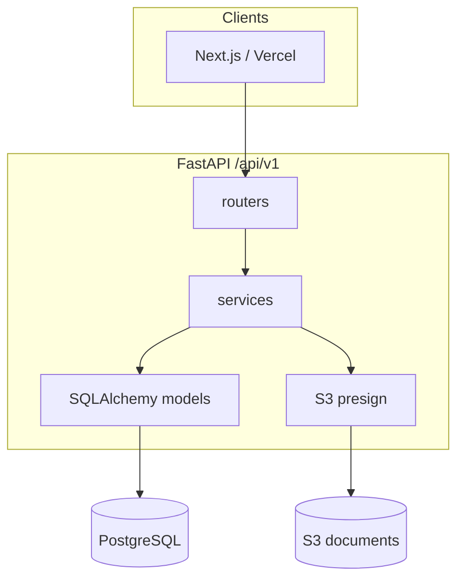

# KrishiFarms CRM — Agent Guide

**Master reference for AI coding agents** (Cursor, Copilot, Claude Code, etc.). Start with [AGENTS.md](../AGENTS.md) for a quick scan; use this document for depth.

---

## Table of Contents

1. [Project Snapshot](#1-project-snapshot)
2. [Documentation Hierarchy](#2-documentation-hierarchy)
3. [Implementation Status Matrix](#3-implementation-status-matrix)
4. [Repository Map](#4-repository-map)
5. [Architecture Overview](#5-architecture-overview)
6. [Database Guide](#6-database-guide)
7. [API Guide](#7-api-guide)
8. [Module Deep-Dives](#8-module-deep-dives)
9. [Environment Variables](#9-environment-variables)
10. [CI/CD and Deployment](#10-cicd-and-deployment)
11. [Common Agent Workflows](#11-common-agent-workflows)
12. [Documentation Maintenance](#12-documentation-maintenance)
13. [Changelog](#13-changelog)
14. [Phase Roadmap](#14-phase-roadmap)
15. [Anti-Patterns and Gotchas](#15-anti-patterns-and-gotchas)
16. [Cross-Links](#16-cross-links)

---

## 1. Project Snapshot

| Item | Detail |
|------|--------|
| **What** | Backend API for Indian farm operations CRM |
| **Domain** | Procurement (paddy/corn), farmer ledger, workforce, fleet, rentals, finance, documents |
| **Reference village** | Bhairkhanpally, Telangana |
| **Currency / locale** | INR; bilingual English/Telugu (`*_te` columns, `Accept-Language`) |
| **Tenancy** | Single DB, `org_id` on all business rows |
| **Scale target** | Single EC2 (`t3.small`) + Docker Compose; partitioned tables for growth |
| **Deploy target** | AWS `ap-south-1` — EC2 + S3; frontend planned on Vercel |
| **Repo** | [gvsharma/krishifarms-backend](https://github.com/gvsharma/krishifarms-backend) |
| **Version** | `0.1.0` (foundation release, commit `60bb2b5`) |

**Critical fact for agents:** The **database schema and OpenAPI contract are complete** for Phases 1–5. **Python implementation is Phase 1 only.** Do not assume an OpenAPI path has a live route — check [§3](#3-implementation-status-matrix) and `app/main.py`.

---

## 2. Documentation Hierarchy

```text
README.md              → Human onboarding, quick start
AGENTS.md              → Scannable agent entry (read first)
docs/AGENT_GUIDE.md    → This file — comprehensive reference
docs/ARCHITECTURE.md   → System topology, data flow, AWS
docs/CHANGELOG.md      → What changed (update on every PR)
docs/api/              → OpenAPI contract (source of truth for API shape)
docs/modules/          → Per-module design docs
docs/reporting/        → Dashboard SQL, KPIs
docs/deploy/           → CI/CD details
.cursor/rules/         → Auto-loaded Cursor rules (doc maintenance)
```

**Read order for new agents:**

1. [AGENTS.md](../AGENTS.md) — 5 min orientation
2. This guide — §3 status matrix + relevant §11 playbook
3. Module-specific doc if touching that domain
4. Migration file + OpenAPI path before implementing Phase 2+

---

## 3. Implementation Status Matrix

**Legend:** ✅ Implemented | 🟡 Partial | 📋 Schema + OpenAPI only | ⬜ Planned

### 3.1 API modules

| Module | Python | Routes in `main.py` | SQLAlchemy model | DB migration | OpenAPI | Phase |
|--------|--------|---------------------|------------------|--------------|---------|-------|
| Auth | ✅ | ✅ | — | `001` | `paths/auth.yaml` | 1 |
| Users / Roles | ✅ | ✅ | ✅ | `001`, `002`, `015` | in `001` spec | 1 |
| Villages / Crop types | ✅ | ✅ | ✅ | `001`, `003` | in master paths | 1 |
| Expense categories | ✅ | ✅ | ✅ | `001` | in financial paths | 1 |
| Documents | 🟡 | ✅ | 🟡 | `001`, `007` | `paths/documents.yaml` | 1 |
| Audit / Activity | ✅ | ✅ | ✅ | `001`, `013` | in platform paths | 1 |
| Dashboard / Health | 🟡 | ✅ | — | — | in platform paths | 1 |
| Farmers | ⬜ | — | — | `004` | `paths/farmers.yaml` | 2 |
| Farms | ⬜ | — | — | `006` | `paths/farms.yaml` | 4 |
| Procurements | ⬜ | — | — | `008` | `paths/procurement.yaml` | 2 |
| Farmer payments / Ledger | ⬜ | — | — | `008` | `paths/payments.yaml` | 2 |
| Workers | ⬜ | — | — | `005` | `paths/workers.yaml` | 4 |
| Work orders / Attendance | ⬜ | — | — | `009` | `paths/work-orders.yaml` | 4 |
| Assets / Vehicle trips | ⬜ | — | — | `010` | `paths/assets.yaml`, `vehicles.yaml` | 5 |
| Rentals | ⬜ | — | — | `011` | `paths/rentals.yaml` | 5 |
| Expenses | ⬜ | — | — | `012` | `paths/expenses.yaml` | 3 |
| Collections / Payments | ⬜ | — | — | `012` | `paths/collections.yaml`, `payments.yaml` | 3 |
| AI / OCR | ⬜ | — | — | `014` | stubs in documents | 5+ |
| Global search | ⬜ | — | — | — | `paths/search.yaml` | 5+ |

### 3.2 Supporting systems

| System | Status | Location |
|--------|--------|----------|
| Full DB schema | ✅ | `alembic/versions/202506210001`–`015` |
| RBAC permissions (DB seed) | ✅ | Migration `015` |
| RBAC permissions (Python seed) | 🟡 Phase 1 subset | `app/shared/permissions.py` |
| Reporting SQL (8 dashboards) | ✅ | `docs/reporting/sql/` |
| Synthetic UAT data | ✅ | `scripts/synthetic_seed/` |
| CI/CD pipeline | ✅ | `.github/workflows/` |
| Cache layer | ✅ | `app/core/cache/` |
| Unit tests | ⬜ | No `tests/` directory yet |
| Frontend | ⬜ | `frontend/` placeholder only — [docs/ui/FRONTEND_ARCHITECTURE.md](./ui/FRONTEND_ARCHITECTURE.md) |

### 3.3 Registered SQLAlchemy models (`app/models.py`)

Only Phase 1 tables: `Organization`, `User`, `Role`, `Permission`, `RefreshToken`, `Village`, `CropType`, `ExpenseCategory`, `Document`, `DocumentLink`, `AuditLog`, `ActivityFeed`.

Phase 2+ tables exist in DB but have **no Python models yet**.

---

## 4. Repository Map

| Path | Purpose |
|------|---------|
| `app/main.py` | FastAPI app; mounts `/api/v1` sub-app with Phase 1 routers |
| `app/models.py` | Alembic model registry — import every new model here |
| `app/core/config.py` | pydantic-settings from `.env` |
| `app/core/database.py` | SQLAlchemy engine + `SessionLocal` |
| `app/core/dependencies.py` | `get_db`, JWT auth, `require_permission()`, permission cache |
| `app/core/security.py` | JWT + password hashing |
| `app/core/exceptions.py` | `AppError` hierarchy |
| `app/core/cache/` | `CacheProvider` — none / memory / redis |
| `app/modules/<domain>/` | `router.py`, `service.py`, `schemas.py`, `models.py` |
| `app/shared/permissions.py` | `SYSTEM_PERMISSIONS`, `ROLE_PERMISSIONS` (Phase 1) |
| `app/shared/schemas/common.py` | `APIResponse`, `PaginatedResponse` |
| `app/shared/services/s3.py` | S3 presigned URLs |
| `app/shared/services/audit.py` | `write_audit_log` helper |
| `alembic/versions/` | Migrations `001`–`015` |
| `alembic/env.py` | Uses `app.models.Base` metadata |
| `migration_utils.py` | Shared Alembic helpers |
| `docs/api/` | OpenAPI spec + `API_CONTRACT.md` |
| `docs/modules/` | Module design docs |
| `docs/reporting/` | Reporting architecture, KPIs, SQL |
| `docs/deploy/` | CI/CD documentation |
| `infra/docker-compose.yml` | Local dev stack |
| `infra/docker-compose.prod.yml` | Production EC2 stack |
| `infra/nginx/` | Reverse proxy config |
| `deploy/scripts/` | EC2 bootstrap, remote deploy, SSM |
| `scripts/seed.py` | Default org, roles, owner, master data |
| `scripts/smoke-test-api.sh` | Post-deploy API checks |
| `scripts/synthetic_seed/` | Demo data generator + load/purge SQL |
| `frontend/` | Vercel/Next.js placeholder |
| `.github/workflows/` | `ci.yml`, `validate.yml`, `deploy.yml` |
| `.cursor/rules/` | Cursor agent rules (auto-loaded) |
| `AGENTS.md` | Short agent entry point |
| `README.md` | Human README |
| `pyproject.toml` | Package metadata, optional `[redis]` extra |
| `.env.example` | Local env template (no secrets) |

---

## 5. Architecture Overview

**Pattern:** Modular monolith — one FastAPI process, domain modules, shared PostgreSQL.



**Request path:** Client → nginx (prod) → FastAPI router → `require_permission()` → service (org-scoped query) → `APIResponse`.

Full topology: [ARCHITECTURE.md](./ARCHITECTURE.md).

---

## 6. Database Guide

### 6.1 Migration chain

| Rev | File | Domain |
|-----|------|--------|
| `001` | `initial_platform_schema` | Orgs, IAM, villages, crops, documents, audit |
| `002` | `extensions_and_platform_enhancements` | Telugu, scopes, triggers |
| `003` | `master_data_extensions` | Activity types, payment modes, sequences |
| `004` | `farmers` | Farmers, bank accounts, land |
| `005` | `workers` | Workers, skills |
| `006` | `farms` | Farms, activities |
| `007` | `documents_enhancements` | OCR, locale, archive, links |
| `008` | `procurements_and_payments` | Procurements, ledger, farmer payments |
| `009` | `work_orders_and_attendance` | Workforce ops |
| `010` | `assets_and_vehicle_trips` | Fleet |
| `011` | `rentals` | Rental customers, agreements |
| `012` | `financial_core` | Transactions, expenses, collections |
| `013` | `audit_and_sync_enhancements` | Audit indexes, sync |
| `014` | `ai_support_tables` | AI jobs, OCR, WhatsApp |
| `015` | `seed_permissions_and_roles` | Permissions + org roles |

See also [alembic/versions/README.md](../alembic/versions/README.md).

### 6.2 Migration helpers (`migration_utils.py`)

| Helper | Purpose |
|--------|---------|
| `audit_columns()` | `created_by`, `updated_by`, `deleted_at`, timestamps |
| `org_fk()` | FK to `organizations.id` |
| `create_monthly_partitions(table, column, year)` | Monthly range partitions |
| `create_extensions()` | `pgcrypto`, `pg_trgm` |

**Naming:** `YYYYMMDDHHMM_description.py`

### 6.3 Partitioned tables

Monthly partitions on date keys (2026 seeded). Examples:

`procurements`, `farmer_ledger_entries`, `farmer_payments`, `attendance_records`, `vehicle_trips`, `asset_usage_logs`, `expenses`, `collections`, `payments`, `financial_transactions`, `farm_activities`

**Rule:** Fetch by ID on partitioned tables requires partition date query param (see [API_CONTRACT.md](./api/API_CONTRACT.md)).

Add future year partitions in new migrations or manual SQL.

### 6.4 Immutable ledger

`farmer_ledger_entries` — trigger `prevent_ledger_mutation`. **Never UPDATE or DELETE.** Use reversing entries.

### 6.5 Soft delete

Set `deleted_at = now()` + `updated_by`. Filter `deleted_at IS NULL` in all reads.

### 6.6 Multi-tenancy

Every business row has `org_id`. Resolve from JWT (`ctx.user.org_id`), never from untrusted request body.

### 6.7 After schema changes

```bash
alembic upgrade head
# Update docs/reporting/sql/ if fact tables changed
# Update docs/AGENT_GUIDE.md §3 matrix if module status changed
```

---

## 7. API Guide

### 7.1 Spec location

| Resource | Path |
|----------|------|
| Entry point | `docs/api/openapi.yaml` |
| Paths (modular) | `docs/api/paths/*.yaml` |
| Schemas | `docs/api/schemas/*.yaml` |
| Human contract | `docs/api/API_CONTRACT.md` |
| Bundled (Postman) | `docs/api/openapi.bundled.yaml` |

Bundle command: `npx @redocly/cli bundle docs/api/openapi.yaml -o docs/api/openapi.bundled.yaml`

### 7.2 Adding an endpoint

1. Update `docs/api/paths/<module>.yaml` and schemas **first** (OpenAPI-first).
2. Implement `schemas.py` → `service.py` → `router.py`.
3. Use `require_permission("resource:action")` — permission must exist in migration `015`.
4. Wrap response in `APIResponse(data=...)` from `app/shared/schemas/common.py`.
5. Scope all queries by `ctx.user.org_id`.
6. Mount router in `app/main.py` if new module.
7. Run `ruff check app`.
8. Update [CHANGELOG.md](./CHANGELOG.md) and §3 matrix if status changes.

### 7.3 RBAC pattern

```python
ctx: CurrentUserContext = Depends(require_permission("villages:read"))
```

Permissions cached via `CacheProvider` (TTL: `CACHE_TTL_SECONDS`).

### 7.4 Response envelope

Success: `{ "success": true, "data": {...}, "meta": { "request_id": "..." } }`

Error: `{ "success": false, "error": { "message": "...", "details": {...} } }`

### 7.5 List endpoints

- Params: `page` (≥1), `page_size` (1–100, default 20)
- Return `PaginatedResponse` with `items`, `total`, `page`, `page_size`
- Financial POST: `Idempotency-Key` header (when implemented)

---

## 8. Module Deep-Dives

### 8.1 Auth (`app/modules/auth/`)

| File | Role |
|------|------|
| `router.py` | `POST /auth/login`, `/refresh`, `/logout` |
| `service.py` | Credential check, token issue/revoke |
| `schemas.py` | Login request, token response |

Public endpoints (no `require_permission`). JWT access + refresh tokens.

### 8.2 Users (`app/modules/users/`)

Org-scoped users and RBAC roles. Models: `User`, `Role`, `Permission`, `Organization`, `RefreshToken`.

Seed roles via `scripts/seed.py`; full permission list in migration `015`.

### 8.3 Documents (`app/modules/documents/`)

**Implemented:** presign upload, register, list, get, download URL, link.

**Gaps:** search, tags, batch presign, PATCH, archive, OCR wiring — see [DOCUMENT_MANAGEMENT.md](./modules/DOCUMENT_MANAGEMENT.md) §2.

**Flow:** `POST presign-upload` → client PUT to S3 → `POST /documents` register → optional `POST link`.

S3 keys: `app/shared/services/s3.py`. Design: [DOCUMENT_MANAGEMENT.md](./modules/DOCUMENT_MANAGEMENT.md).

### 8.4 Reporting (`docs/reporting/`)

| File | Dashboard |
|------|-----------|
| `sql/01_procurement.sql` | Procurement |
| `sql/02_farmer_payments.sql` | Farmer payments |
| `sql/03_worker_productivity.sql` | Workforce |
| `sql/04_vehicle_utilization.sql` | Fleet |
| `sql/05_rental_income.sql` | Rentals |
| `sql/06_expense.sql` | Expenses |
| `sql/07_profitability.sql` | Profitability |
| `sql/08_farm_operations.sql` | Farm ops |

All queries use `:org_id`, `:date_from`, `:date_to`. Architecture: [REPORTING_ARCHITECTURE.md](./reporting/REPORTING_ARCHITECTURE.md). KPIs: [kpi_definitions.md](./reporting/kpi_definitions.md).

### 8.5 Synthetic seed (`scripts/synthetic_seed/`)

Demo data for UAT — Bhairkhanpally, 50 farmers, 200 procurements, etc.

| Step | Command / file |
|------|----------------|
| Generate | `python scripts/synthetic_seed/generate_synthetic_data.py` |
| Load | `sql/01_load_synthetic_data.sql` (after prerequisites) |
| Purge | `sql/99_purge_synthetic_data.sql` |

**⚠️ Purge before real production data.** See [synthetic_seed/README.md](../scripts/synthetic_seed/README.md).

### 8.6 Deploy (`deploy/`, `docs/deploy/`)

| Script | Purpose |
|--------|---------|
| `ec2-bootstrap.sh` | One-time EC2 setup |
| `remote-deploy.sh` | Extract bundle, migrate, compose up, health check, rollback |
| `ssm-kickoff-deploy.sh` | Async SSM deploy trigger |
| `sync-env-from-ssm.sh` | Optional SSM secret sync |

CI/CD: [CI_CD.md](./deploy/CI_CD.md). EC2 layout: [deploy/README.md](../deploy/README.md).

---

## 9. Environment Variables

Set in `.env` (local) or `/opt/krishifarms/config/application.env` (production). Templates: `.env.example`, `deploy/env/application.env.example`.

| Variable | Purpose |
|----------|---------|
| `APP_NAME` | Display name |
| `APP_ENV` | Environment label |
| `DEBUG` | Swagger + verbose errors |
| `SECRET_KEY` | JWT signing |
| `ACCESS_TOKEN_EXPIRE_MINUTES` | Access token TTL |
| `REFRESH_TOKEN_EXPIRE_DAYS` | Refresh token TTL |
| `DATABASE_URL` | PostgreSQL connection string |
| `CACHE_PROVIDER` | `none` / `memory` / `redis` |
| `CACHE_TTL_SECONDS` | Permission cache TTL |
| `REDIS_URL` | Redis connection (if redis provider) |
| `AWS_REGION` | S3 region (`ap-south-1`) |
| `AWS_ACCESS_KEY_ID` | Optional (use IAM role on EC2) |
| `AWS_SECRET_ACCESS_KEY` | Optional |
| `S3_BUCKET_NAME` | Document bucket |
| `S3_PRESIGNED_URL_EXPIRE_SECONDS` | Presign TTL |
| `CORS_ORIGINS` | Comma-separated allowed origins |
| `DEFAULT_ORG_NAME` | Seed org name |
| `DEFAULT_OWNER_EMAIL` | Seed owner email |
| `DEFAULT_OWNER_PASSWORD` | Seed owner password |
| `DEFAULT_OWNER_NAME` | Seed owner display name |
| `POSTGRES_PASSWORD` | Production Docker postgres (see deploy env example) |

**Never commit secrets.**

---

## 10. CI/CD and Deployment

| Workflow | Trigger | Action |
|----------|---------|--------|
| `ci.yml` | PR + push `main` | Calls `validate.yml` |
| `validate.yml` | Reusable | Ruff, Docker build, Trivy; frontend when added |
| `deploy.yml` | Push `main` | Validate → bundle → S3 → SSM → EC2 deploy |

**Branch policy:** Never push directly to `main`. Work on feature branches, open PR → `main`. CI validates on PR (and on post-merge `push` to `main`). **Deploy runs only when `deploy.yml` fires on `push` to `main`** (merged PR), not on feature-branch pushes alone.

**Health check:** `GET /api/v1/health`

**Rollback:** Automatic on failed health check; manual via backup in `/opt/krishifarms/backup/`.

Details: [CI_CD.md](./deploy/CI_CD.md).

---

## 11. Common Agent Workflows

### 11.1 New feature (Phase 2+ module)

1. Read migration(s) in `alembic/versions/` for table shape.
2. Read OpenAPI path in `docs/api/paths/<module>.yaml`.
3. Create `app/modules/<name>/` — `models.py`, `schemas.py`, `service.py`, `router.py`.
4. Import models in `app/models.py`.
5. Mount router in `app/main.py`.
6. Add permissions to `app/shared/permissions.py` if needed for `seed.py`.
7. Verify permission exists in migration `015` (or add new migration).
8. `ruff check app` + `alembic upgrade head`.
9. Update docs (see [§12](#12-documentation-maintenance)).

### 11.2 New migration

1. `alembic revision -m "short_description"`
2. Rename to `YYYYMMDDHHMM_description.py` if needed.
3. Use `migration_utils` helpers; set `down_revision` correctly.
4. For partitioned tables: `create_monthly_partitions`.
5. Test: `alembic upgrade head` and `alembic downgrade -1`.
6. Update `alembic/versions/README.md` if new revision.
7. Update [CHANGELOG.md](./CHANGELOG.md).

### 11.3 New dashboard / reporting query

1. Read [REPORTING_ARCHITECTURE.md](./reporting/REPORTING_ARCHITECTURE.md) and [kpi_definitions.md](./reporting/kpi_definitions.md).
2. Add SQL to `docs/reporting/sql/` with `:org_id`, `:date_from`, `:date_to`.
3. Filter `deleted_at IS NULL` where applicable.
4. Use partition date columns for range filters.
5. Update [CHANGELOG.md](./CHANGELOG.md).

### 11.4 New API endpoint (existing module)

1. Read `docs/api/paths/<module>.yaml`.
2. Add schema → service → route.
3. `require_permission()` + org scoping.
4. `ruff check app`.
5. Update [CHANGELOG.md](./CHANGELOG.md).

### 11.5 Deploy / infra change

1. Edit workflow or `deploy/scripts/` / `infra/`.
2. Update [CI_CD.md](./deploy/CI_CD.md) and/or [deploy/README.md](../deploy/README.md).
3. Update [CHANGELOG.md](./CHANGELOG.md).
4. If env vars change: `.env.example`, `deploy/env/application.env.example`, §9 above.

### 11.6 Run locally

```bash
cp .env.example .env
docker compose -f infra/docker-compose.yml up -d --build
docker compose -f infra/docker-compose.yml exec api alembic upgrade head
docker compose -f infra/docker-compose.yml exec api python scripts/seed.py
```

Login: `owner@krishifarms.local` / `ChangeMe123!`

---

## 12. Documentation Maintenance

**Rule:** When making any code or config change, update relevant docs in the same change. Cursor enforces this via `.cursor/rules/maintain-agent-docs.mdc`.

| Change type | Update |
|-------------|--------|
| Any code/config change | [CHANGELOG.md](./CHANGELOG.md) — `[Unreleased]` section |
| Module implemented / status change | This file §3 matrix |
| New convention or quick reference | [AGENTS.md](../AGENTS.md) |
| Module behavior / design | `docs/modules/<MODULE>.md` |
| API shape | `docs/api/paths/`, `docs/api/schemas/`, [API_CONTRACT.md](./api/API_CONTRACT.md) |
| Setup commands / env vars | [README.md](../README.md), `.env.example` |
| Schema / partitions | `alembic/versions/README.md`, reporting SQL if affected |
| Deploy / CI | [CI_CD.md](./deploy/CI_CD.md), [deploy/README.md](../deploy/README.md) |
| Architecture change | [ARCHITECTURE.md](./ARCHITECTURE.md) |

**Principles:**

- Read actual code before writing docs — docs must match implementation.
- Prefer tables and matrices over long prose.
- Keep entries concise (what changed, why), not essays.
- Move `[Unreleased]` items to a dated version section on release.

---

## 13. Changelog

All notable changes: [CHANGELOG.md](./CHANGELOG.md) (Keep a Changelog format).

Current foundation release: **0.1.0** (2025-06-21, commit `60bb2b5`).

---

## 14. Phase Roadmap

| Phase | Scope | API status | DB status |
|-------|-------|------------|-----------|
| **1** ✅ | Auth, users, master data, expense categories, documents (partial), audit, dashboard | Live Python | ✅ |
| **2** | Farmers, procurements, farmer ledger/payments | OpenAPI only | ✅ |
| **3** | Expenses, collections, general payments | OpenAPI only | ✅ |
| **4** | Farms, workers, work orders, attendance | OpenAPI only | ✅ |
| **5+** | Fleet, rentals, AI/OCR, global search | OpenAPI only | ✅ |

Database migrations for Phases 2–5 already exist; Python routes follow incrementally.

---

## 15. Anti-Patterns and Gotchas

| Don't | Why |
|-------|-----|
| Assume OpenAPI path is implemented | Check `app/main.py` and §3 matrix |
| Commit `.env`, `application.env`, secrets | Security |
| Hard-delete ledger rows | Immutable by trigger |
| Hard-delete soft-deletable entities | Use `deleted_at` |
| Accept `org_id` from client without JWT check | Tenant leak |
| Use `float` for money | Use `Decimal` / `NUMERIC(14,2)` |
| Skip `org_id` in SQL/reporting | Cross-tenant data leak |
| Implement endpoints without OpenAPI check | Contract drift |
| UPDATE/DELETE `farmer_ledger_entries` | Use reversing entries |
| Load synthetic seed in prod without purge | Data contamination |
| Force-push `main` | Triggers production deploy |
| Forget partition date on ID lookups | Wrong/missing rows |
| Add model without `app/models.py` import | Alembic won't see table |

---

## 16. Cross-Links

| Document | Path |
|----------|------|
| Agent entry | [AGENTS.md](../AGENTS.md) |
| Human README | [README.md](../README.md) |
| Architecture | [ARCHITECTURE.md](./ARCHITECTURE.md) |
| Changelog | [CHANGELOG.md](./CHANGELOG.md) |
| API contract | [API_CONTRACT.md](./api/API_CONTRACT.md) |
| OpenAPI spec | [openapi.yaml](./api/openapi.yaml) |
| Document management | [DOCUMENT_MANAGEMENT.md](./modules/DOCUMENT_MANAGEMENT.md) |
| Reporting | [REPORTING_ARCHITECTURE.md](./reporting/REPORTING_ARCHITECTURE.md) |
| KPI definitions | [kpi_definitions.md](./reporting/kpi_definitions.md) |
| CI/CD | [CI_CD.md](./deploy/CI_CD.md) |
| EC2 deploy | [deploy/README.md](../deploy/README.md) |
| Synthetic seed | [scripts/synthetic_seed/README.md](../scripts/synthetic_seed/README.md) |
| Migrations | [alembic/versions/README.md](../alembic/versions/README.md) |
| Frontend (planned) | [frontend/README.md](../frontend/README.md), [docs/ui/FRONTEND_ARCHITECTURE.md](./ui/FRONTEND_ARCHITECTURE.md) |
