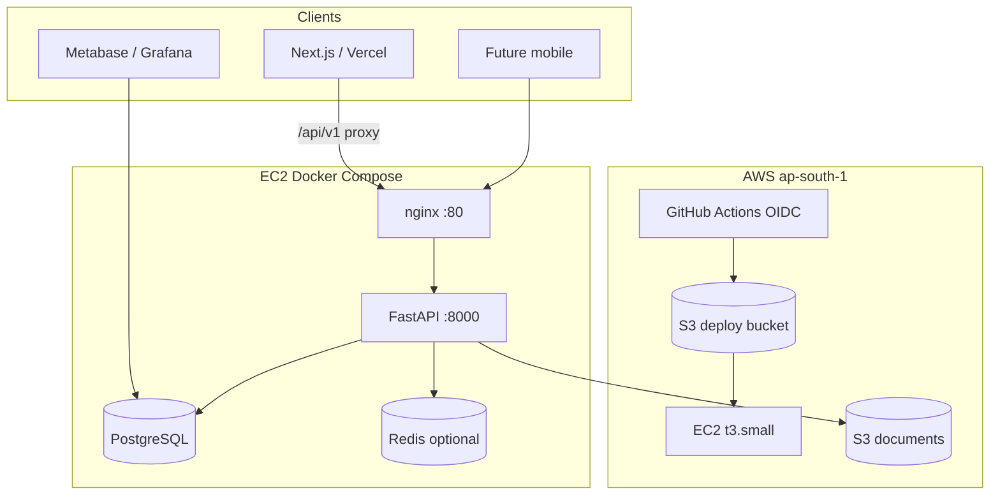
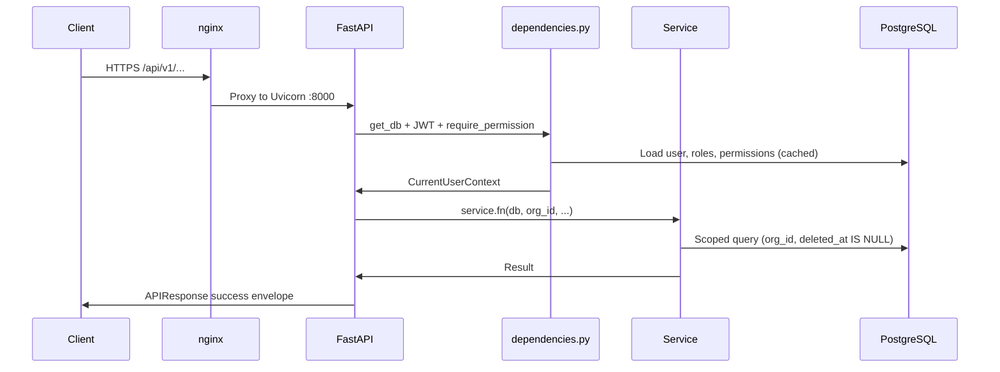
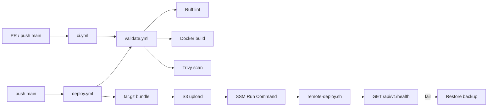

# KrishiFarms CRM — System Architecture

High-level technical architecture for agents and developers. For implementation status and playbooks, see [AGENT_GUIDE.md](./AGENT_GUIDE.md).

---

## 1. Overview

KrishiFarms CRM is a **modular monolith** — a single FastAPI application with domain modules, one PostgreSQL database, and S3 for file storage. Multi-tenant by `org_id`; designed for Indian farm operations (procurement, ledger, workforce, fleet, rentals, finance).

| Attribute | Value |
|-----------|-------|
| Backend | Python 3.12, FastAPI, SQLAlchemy 2.x, Alembic |
| Database | PostgreSQL 16 (Docker on EC2; RDS optional later) |
| Auth | JWT (access + refresh), RBAC permission codes |
| Files | AWS S3 (`ap-south-1`), presigned upload/download |
| Cache | Pluggable: none / in-memory / Redis |
| Frontend | Next.js planned on Vercel (placeholder only) |
| Deploy | GitHub Actions → S3 → SSM → EC2 Docker Compose |

---

## 2. Components

### 2.1 Application layers

| Layer | Location | Responsibility |
|-------|----------|----------------|
| HTTP routers | `app/modules/*/router.py` | Auth, validation, `APIResponse` envelope |
| Services | `app/modules/*/service.py` | Business rules, queries, org scoping |
| Models | `app/modules/*/models.py` | SQLAlchemy ORM (Phase 1 modules only) |
| Schemas | `app/modules/*/schemas.py` | Pydantic request/response DTOs |
| Core | `app/core/` | Config, DB session, JWT, cache, exceptions |
| Shared | `app/shared/` | Permissions, S3, audit, common schemas |

### 2.2 Contract vs code

The **OpenAPI spec** (`docs/api/`) describes the full target API. **Python routes** in `app/main.py` implement Phase 1 only. Agents must check the [implementation matrix](./AGENT_GUIDE.md#3-implementation-status-matrix) before assuming an endpoint exists.

### 2.3 Reporting

No separate data warehouse. Dashboard SQL in `docs/reporting/sql/` runs against operational tables with `:org_id` and date-range parameters. Future API aggregation endpoints may wrap these queries.

---

## 3. Request Flow

### Error handling

`AppError` subclasses (`NotFoundError`, `ForbiddenError`, `ConflictError`) return `{ success: false, error: { message, details } }`. Unhandled exceptions return 500 (message hidden when `DEBUG=false`).

---

## 4. Data Architecture

### 4.1 Multi-tenancy

- Every business table has `org_id` FK to `organizations`.
- JWT carries `user.org_id`; services **never** trust client-supplied `org_id`.
- Roles and permissions are org-scoped (seeded per org in migration `015`).

### 4.2 Partitioning

High-volume fact tables are **range-partitioned by month** on date columns (`procurement_date`, `payment_date`, `entry_date`, etc.). Migrations seed 2026 partitions. Lookups by ID require the partition date (query param per API contract).

### 4.3 Immutable ledger

`farmer_ledger_entries` has trigger `prevent_ledger_mutation` — no UPDATE/DELETE. Corrections use reversing entries.

### 4.4 Soft delete

Entities with `audit_columns()` use `deleted_at`; reads filter `deleted_at IS NULL`.

### 4.5 Money & locale

- Amounts: `NUMERIC(14,2)` in DB; `Decimal` in Python (never `float`).
- Bilingual: `*_te` columns for Telugu; `Accept-Language: en|te` on API.

---

## 5. AWS Topology

| Resource | Purpose | Region |
|----------|---------|--------|
| EC2 | API + PostgreSQL + nginx (Docker Compose) | `ap-south-1` |
| S3 `krishifarms-documents` | Document storage (IAM role on EC2) | `ap-south-1` |
| S3 deploy bucket | CI/CD artifact staging | `ap-south-1` |
| SSM | Run Command deploy (no SSH from GHA) | `ap-south-1` |
| Vercel | Future frontend CDN + `/api/v1` rewrite to EC2 | Global |

Production config lives at `/opt/krishifarms/config/application.env` on EC2 — never committed.

---

## 6. Frontend / Backend Split

| Concern | Owner |
|---------|-------|
| REST API | EC2 FastAPI (`/api/v1`) |
| Auth tokens | Backend issues JWT; frontend stores and sends `Authorization` header |
| File upload | Frontend: presign URL from API → PUT to S3 → register via API |
| Dashboards | SQL ready; UI not built — Metabase or future React |
| CORS | `CORS_ORIGINS` must include Vercel URL when frontend ships |

`frontend/` contains Vercel rewrite config only (`vercel.json` proxies `/api/v1` to EC2).

---

## 7. Security Model

| Mechanism | Implementation |
|-----------|----------------|
| Authentication | JWT access token (short TTL) + refresh token |
| Authorization | RBAC — permission codes like `farmers:read` via `require_permission()` |
| Tenant isolation | `org_id` on every query |
| Secrets | `SECRET_KEY`, DB password, AWS keys in env only |
| Deploy | OIDC role for GitHub Actions; SSM for EC2 commands |
| Documents | S3 presigned URLs; org prefix in object keys |

Full permission list seeded in migration `015`. Phase 1 Python subset in `app/shared/permissions.py`.

---

## 8. CI/CD Flow

Details: [docs/deploy/CI_CD.md](./deploy/CI_CD.md), [deploy/README.md](../deploy/README.md).

---

## 9. Related Documents

| Document | Focus |
|----------|-------|
| [AGENT_GUIDE.md](./AGENT_GUIDE.md) | Master agent reference, playbooks, status matrix |
| [AGENTS.md](../AGENTS.md) | Quick entry point |
| [API_CONTRACT.md](./api/API_CONTRACT.md) | REST standards, endpoint catalog |
| [REPORTING_ARCHITECTURE.md](./reporting/REPORTING_ARCHITECTURE.md) | Dashboard SQL, KPIs, partitions |
| [DOCUMENT_MANAGEMENT.md](./modules/DOCUMENT_MANAGEMENT.md) | S3, OCR, tagging design |
| [CHANGELOG.md](./CHANGELOG.md) | Release history |
