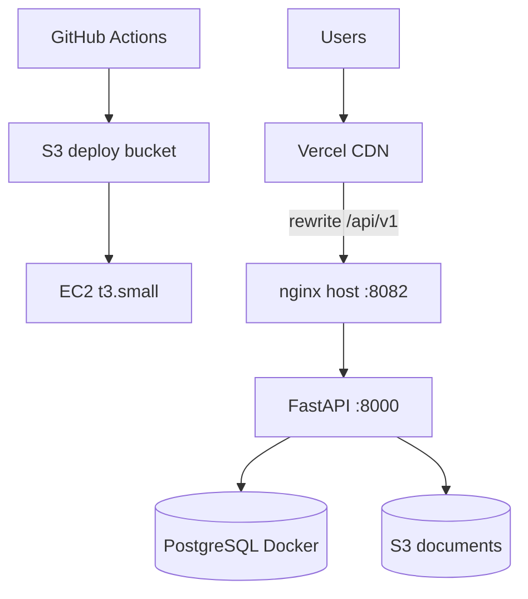

# CI/CD — KrishiFarms CRM

Production deployment mirrors [Gamya Couture (gamyaboutique)](https://github.com/gvsharma/gamyaboutique):

- **Frontend:** Vercel (Next.js, API proxy rewrite)
- **Backend:** EC2 + Docker Compose (FastAPI + PostgreSQL + nginx)
- **CI/CD:** GitHub Actions → S3 artifacts → SSM Run Command (no SSH from runners)
- **AWS region:** `ap-south-1` (same account as Gamyaboutique)

Reference source: `/Users/venkatgorinta/Desktop/gamya-boutique`

---

## Same as Gamya (SSM deploy orchestration)

KrishiFarms uses the **same S3 → SSM → async kickoff → status poll** pattern as [Gamya Couture](https://github.com/gvsharma/gamyaboutique). Only runtime stack and paths differ.

| Step | Gamya Couture | KrishiFarms CRM |
|------|---------------|-----------------|
| **Trigger** | Push to `main` | Push to `main` |
| **Build artifact** | Maven JAR → `incoming/gamya-couture.jar` | `deploy.tar.gz` → `incoming/deploy.tar.gz` |
| **S3 script keys** | `incoming/remote-deploy.sh`, `incoming/sync-rds-env-from-ssm.sh`, `incoming/ssm-kickoff-deploy.sh` | Same pattern; `sync-env-from-ssm.sh` + `incoming/application.env.example` |
| **EC2 app path** | `/opt/gamya-couture` | `/opt/krishifarms` |
| **Shared dev EC2** | `i-0426cdc00ff15bfe9` (`gamya-couture-dev-api`) | Same instance |
| **Public nginx port** | **8080** (host nginx → systemd JAR) | **8082** (Docker Compose nginx) |
| **SSM ping attempts** | 36 (48 if cold-start) | 36 (48 if cold-start) |
| **Stale SSM cleanup** | Cancel InProgress/Pending commands &lt; 3 h | Same |
| **SSM probe → kickoff → poll** | Short SSM commands; `nohup ssm-kickoff-deploy.sh` | Same + Docker preflight before kickoff |
| **`deploy.status` lifecycle** | `running` → `success` / `failed` in `${APP_PATH}/logs/` | Same |
| **Status poll** | 36 × 10 s (~6 min) | 36 × 10 s (~6 min) |
| **Public health URL** | `http://<EC2>/actuator/health` | `http://<EC2>:8082/api/v1/health` |
| **Smoke test host** | `http://<EC2>` (port 80) | `http://<EC2>:8082` |
| **Env sync script** | `sync-rds-env-from-ssm.sh` (RDS creds) | `sync-env-from-ssm.sh` (local Postgres + app secrets) |
| **SSM param prefix** | `/gamya-couture/dev/db/*` | `/krishifarms/dev/app/*`, `/krishifarms/dev/db/*` |
| **Runtime deploy** | systemd JAR + host nginx | `docker compose -f infra/docker-compose.prod.yml` + Alembic |
| **One-time bootstrap** | Manual: `ec2-bootstrap.sh` (Java 21, systemd) | Manual: `ec2-bootstrap.sh` (Docker, Compose plugin) |
| **`application.env`** | Created at bootstrap from template | Created at bootstrap; kickoff can seed from S3 template if missing |

### Gamya deploy flow (step-by-step)

1. **Validate** — reusable `validate.yml` (lint/build).
2. **Build** — Gamya: `mvn package`; KrishiFarms: `tar` bundle excluding `.git`, `.venv`.
3. **Resolve config** — OIDC role, `DEPLOY_BUCKET`, EC2 instance (ID or Name tag).
4. **Prepare RDS** (Gamya) — start stopped RDS; KrishiFarms skips unless `RDS_INSTANCE_ID` set.
5. **Prepare EC2** — start if stopped; wait status checks; poll SSM `PingStatus=Online` (36 attempts).
6. **Upload to S3** — artifact + three scripts (+ KrishiFarms env template).
7. **SSM orchestration (GitHub runner)**:
   - Cancel stale SSM commands.
   - **Probe** — verify SSM can run shell (`SSM_PROBE_OK`).
   - **Preflight** (KrishiFarms only) — Docker/Compose available; clear stale `deploy.pid` / `deploy.status`.
   - **Kickoff** — mkdir, download kickoff script, `nohup ssm-kickoff-deploy.sh`, write `deploy.pid`, return `DEPLOY_KICKED_OFF`.
   - **Poll** — read `deploy.status` + tail `deploy.latest.log` until `success` or `failed` (36 × 10 s).
8. **On EC2 (`ssm-kickoff-deploy.sh`)** — download scripts + artifact from S3 → sync env from SSM → `sudo remote-deploy.sh` → write `deploy.status`.
9. **On EC2 (`remote-deploy.sh`)** — Gamya: JAR swap + systemd restart; KrishiFarms: extract tar, `docker compose up`, `alembic upgrade head`, health check, rollback on failure.
10. **Public health** — curl nginx health endpoint from runner.
11. **Smoke tests** — `scripts/smoke-test-api.sh`.

Bootstrap is **one-time manual** on EC2 (Session Manager) for both projects — not automated by the workflow. See [EC2 one-time bootstrap](#ec2-one-time-bootstrap).

---

## Architecture



---


## Branch strategy

| Rule | Detail |
|------|--------|
| Default branch | `main` is production; **never push directly to `main`** |
| Development | All changes on **feature branches**; open a **PR → `main`** |
| Pre-merge checks | `ci.yml` runs on **pull_request** targeting `main` (validation only) |
| Production deploy | **`deploy.yml` runs only on `push` to `main`** — i.e. after a merged PR |
| Feature-branch pushes | Pushes to feature branches **do not** trigger deploy; CI runs only when a PR targets `main` |
| Agents | Use feature branch + PR; **never** push or force-push to `main` |

No workflow auto-merges or pushes to `main`.


## Workflows

| Workflow | Trigger | Purpose |
|----------|---------|---------|
| `ci.yml` | PR + push to `main` | Runs `validate.yml` |
| `validate.yml` | Called by CI/deploy | Ruff lint, Docker build, Trivy scan; frontend when added |
| `deploy.yml` | Push to `main` only | Validate → bundle → S3 → SSM → Docker Compose deploy |

**After merge:** Merging a PR into `main` creates a `push` to `main`, which runs `ci.yml` (validation) and `deploy.yml` (EC2 deploy). Direct commits or pushes to `main` use the same triggers — avoid them; use feature branches and PRs instead.

---

## Required GitHub secrets & variables

Configure in **Settings → Secrets and variables → Actions** for `gvsharma/krishifarms-backend`.

### Secrets (required)

| Name | Description |
|------|-------------|
| `AWS_BACKEND_DEPLOY_ROLE_ARN` | IAM role for GitHub OIDC. Same pattern as Gamyaboutique — create a role (or extend existing) with S3 deploy bucket access + SSM SendCommand on the KrishiFarms EC2 instance. |

### Variables or secrets (required)

| Name | Example | Description |
|------|---------|-------------|
| `DEPLOY_BUCKET` | `krishifarms-dev-backend-deploy` | S3 bucket for deploy artifacts. Gamyaboutique uses `gamya-couture-dev-backend-deploy`. |
| `EC2_INSTANCE_ID` | `i-0426cdc00ff15bfe9` | **Required for shared Gamya EC2.** Target instance ID; when set, name-tag lookup is skipped. |
| `EC2_HOST` | `13.232.200.243` | **Required for shared Gamya EC2.** Public IP for health checks and smoke tests. |

### Optional (auto-resolved if omitted)

| Name | Example | Description |
|------|---------|-------------|
| `EC2_NAME_TAG` | `gamya-couture-dev-api` | EC2 `Name` tag for lookup when `EC2_INSTANCE_ID` is unset. Workflow defaults to `gamya-couture-dev-api` when `DEPLOY_BUCKET` contains `krishifarms`. |
| `RDS_INSTANCE_ID` | — | Not used by default. KrishiFarms uses local PostgreSQL in Docker Compose. Set only if you migrate to RDS. |
| `AWS_REGION` | `ap-south-1` | Default `ap-south-1` in workflow. |
| `NGINX_LOCAL_PORT` | `8082` | Default `8082` on shared dev EC2. |
| `PUBLIC_HEALTH_CHECK_URL` | `http://13.232.200.243:8082/api/v1/health` | Default built from EC2 host + port. |

### Optional smoke test secrets

| Name | Description |
|------|-------------|
| `SMOKE_TEST_EMAIL` | Owner login email for post-deploy API smoke tests |
| `SMOKE_TEST_PASSWORD` | Owner login password |

**Never commit real secret values.** Use `${{ secrets.XXX }}` and `${{ vars.XXX }}` in workflows only.

### Manual setup (GitHub UI)

On **`gvsharma/krishifarms-backend`** (not `krishifarms-crm`) → **Settings → Secrets and variables → Actions**:

1. **Secrets → New repository secret:** `AWS_BACKEND_DEPLOY_ROLE_ARN` = IAM role ARN from infra (see below).
2. **Variables → New repository variable:** `DEPLOY_BUCKET` = S3 deploy bucket name (e.g. `krishifarms-dev-backend-deploy`).
3. **Variables (shared Gamya EC2 — required):** `EC2_INSTANCE_ID` = `i-0426cdc00ff15bfe9`, `EC2_HOST` = `13.232.200.243`.

Optional variables: `EC2_NAME_TAG` (`gamya-couture-dev-api`), `AWS_REGION`, `NGINX_LOCAL_PORT`, `PUBLIC_HEALTH_CHECK_URL`. Optional secrets: `SMOKE_TEST_EMAIL`, `SMOKE_TEST_PASSWORD`.

### Shared Gamya EC2 (dev)

KrishiFarms dev deploys to the **same EC2** as Gamya Couture — not a separate `krishifarms-dev-api` instance.

| Item | Value |
|------|-------|
| EC2 Name tag | `gamya-couture-dev-api` |
| Instance ID | `i-0426cdc00ff15bfe9` |
| Public IP | `13.232.200.243` |
| KrishiFarms nginx port | **8082** (Gamya uses **8080**) |
| App path on host | `/opt/krishifarms` |

**You must set GitHub Variables `EC2_INSTANCE_ID` and `EC2_HOST`** (see [`.github/DEPLOY_CONFIG.md`](../../.github/DEPLOY_CONFIG.md)). Without them, deploy used to derive tag `krishifarms-dev-api` from `DEPLOY_BUCKET` and fail.

If `EC2_INSTANCE_ID` is omitted, set `EC2_NAME_TAG=gamya-couture-dev-api` or rely on workflow auto-default when `DEPLOY_BUCKET` contains `krishifarms`.

### Where to get values (krishifarms-infra)

Same pattern as Gamya Couture (`gamya-couture-infra` → `backend_deploy_github_setup` output).

```bash
cd krishifarms-infra/environments/dev
terraform output -json backend_deploy_github_setup
```

| Terraform output key | GitHub name | Type |
|----------------------|-------------|------|
| `secret_AWS_BACKEND_DEPLOY_ROLE_ARN` | `AWS_BACKEND_DEPLOY_ROLE_ARN` | **Secret** (required) |
| `variable_DEPLOY_BUCKET` | `DEPLOY_BUCKET` | **Variable** (required) |
| `variable_EC2_INSTANCE_ID` | `EC2_INSTANCE_ID` | **Variable (required for shared EC2)** |
| `variable_EC2_HOST` | `EC2_HOST` | **Variable (required for shared EC2)** |
| `variable_EC2_NAME_TAG` | `EC2_NAME_TAG` | Variable (optional; `gamya-couture-dev-api`) |
| `variable_AWS_REGION` | `AWS_REGION` | Variable (optional; default `ap-south-1`) |

**Auto-sync** (after `gh auth login`, PAT with `repo` on the backend repo):

```bash
export GH_TOKEN=<PAT>
export GITHUB_BACKEND_REPOSITORY=gvsharma/krishifarms-backend
bash krishifarms-infra/scripts/sync-backend-deploy-github-config.sh
```

Or set secret `KRISHIFARMS_GH_TOKEN` on **krishifarms-infra** so Terraform module `github_backend_deploy_config` pushes values on apply (see `krishifarms-infra/docs/GITHUB_ACTIONS.md`).

Locally generated copy: [`.github/DEPLOY_CONFIG.md`](../../.github/DEPLOY_CONFIG.md) (from last Terraform apply — regenerate after infra changes; do not paste ARNs into public docs).

---

## Troubleshooting deploy failures

| Symptom | Likely cause | Action |
|---------|--------------|--------|
| `Missing deploy config::Set AWS_BACKEND_DEPLOY_ROLE_ARN and DEPLOY_BUCKET` | Required secret/variable not set on backend repo | Add both on `gvsharma/krishifarms-backend`; re-run failed job |
| **Create deploy bundle** succeeds, **Resolve deploy configuration** fails | Same — tar/bundle step is fine; config check runs next | Configure secrets (above); no code change needed |
| OIDC `configure-aws-credentials` fails | Wrong/missing role ARN or trust policy repo mismatch | Role trust must include `repo:gvsharma/krishifarms-backend:*` |
| `No EC2 instance found with tag Name=…-api` | Shared Gamya EC2: tag is `gamya-couture-dev-api`, not `krishifarms-dev-api` | Set `EC2_INSTANCE_ID=i-0426cdc00ff15bfe9` and `EC2_HOST=13.232.200.243`, or `EC2_NAME_TAG=gamya-couture-dev-api` |
| SSM PingStatus ≠ Online | Instance stopped, SSM agent down, or missing IAM | Start EC2; verify `AmazonSSMManagedInstanceCore` on instance role |
| **Deploy on EC2 via SSM** times out; `deploy.status=running` | EC2 not bootstrapped: missing `/opt/krishifarms/config/application.env`; kickoff died before marking `failed` | See [EC2 bootstrap](#ec2-one-time-bootstrap). Reset zombie: `echo failed > /opt/krishifarms/logs/deploy.status`. Re-run workflow after bootstrap or SSM secrets are set |
| `application.env not found. Run ec2-bootstrap.sh first` in `deploy.latest.log` | Bootstrap never run; workflow only created empty dirs | Run `ec2-bootstrap.sh` once, or let deploy auto-create env from S3 template (needs real `SECRET_KEY` / `POSTGRES_PASSWORD` via SSM or manual edit) |
| `docker_ok=no` in preflight | Docker not installed on shared host | `sudo APP_PATH=/opt/krishifarms bash deploy/scripts/ec2-bootstrap.sh` via Session Manager |
| Public health check timeout | Bootstrap incomplete, placeholder secrets, or nginx/API not up | Check `/opt/krishifarms/logs/deploy.latest.log` via Session Manager; set SSM params `/krishifarms/dev/app/secret_key` and `/krishifarms/dev/db/password` or edit `application.env` |

### Required vs optional (quick reference)

| Name | Required | Type | Notes |
|------|----------|------|-------|
| `AWS_BACKEND_DEPLOY_ROLE_ARN` | **Yes** | Secret | GitHub OIDC → S3 + SSM deploy role |
| `DEPLOY_BUCKET` | **Yes** | Variable (or secret) | e.g. `krishifarms-dev-backend-deploy` |
| `EC2_INSTANCE_ID` | **Yes** (shared EC2) | Variable/secret | `i-0426cdc00ff15bfe9` — skips name-tag lookup |
| `EC2_HOST` | **Yes** (shared EC2) | Variable/secret | `13.232.200.243` — health/smoke target |
| `EC2_NAME_TAG` | No | Variable/secret | `gamya-couture-dev-api` if instance ID omitted |
| `RDS_INSTANCE_ID` | No | Variable/secret | Skipped by default (local Postgres in Docker) |
| `AWS_REGION` | No | Variable | Default `ap-south-1` in workflow |
| `NGINX_LOCAL_PORT` | No | Variable | Default `8082` on shared dev EC2 |
| `PUBLIC_HEALTH_CHECK_URL` | No | Variable | Default `http://<EC2>:8082/api/v1/health` |
| `SMOKE_TEST_EMAIL` / `SMOKE_TEST_PASSWORD` | No | Secrets | Authenticated post-deploy smoke tests |

After fixing GitHub config, **Re-run jobs** on the failed workflow run (Actions → run → **Deploy to EC2** → Re-run).

---

## AWS setup checklist

Same AWS account and patterns as Gamyaboutique (`gamya-couture-infra`):

- [ ] **Shared EC2** — Gamya host `gamya-couture-dev-api` (`i-0426cdc00ff15bfe9`); set `EC2_INSTANCE_ID` + `EC2_HOST` in GitHub
- [ ] **S3 deploy bucket** (e.g. `krishifarms-dev-backend-deploy`) with EC2 + deploy role access
- [ ] **IAM role** for GitHub OIDC (`AWS_BACKEND_DEPLOY_ROLE_ARN`) — trust `gvsharma/krishifarms-backend`, permissions: S3 Put/Get on deploy bucket, SSM SendCommand, EC2 Describe/Start, optional RDS Start
- [ ] **SSM agent** on EC2 (Amazon Linux 2023 default) with instance role including `AmazonSSMManagedInstanceCore`
- [ ] **Security group:** port **8082** open for KrishiFarms nginx (Gamya uses 8080; Vercel `API_PROXY_TARGET` uses `:8082`)
- [ ] **S3 documents bucket** (`krishifarms-documents`) with EC2 instance role `s3:PutObject` / `s3:GetObject`
- [ ] (Optional) **SSM parameters** for secrets (create in `krishifarms-infra` Terraform or AWS Console):

| Parameter | Purpose |
|-----------|---------|
| `/krishifarms/dev/app/secret_key` | FastAPI `SECRET_KEY` (SecureString) |
| `/krishifarms/dev/db/password` | Docker Postgres `POSTGRES_PASSWORD` + `DATABASE_URL` (SecureString) |

EC2 instance role needs `ssm:GetParameter` on `/krishifarms/dev/*` (mirror Gamya's `/gamya-couture/dev/db/*` grant on the shared host).

You can reuse Gamyaboutique's Terraform patterns from `gamya-couture-infra` — KrishiFarms dev currently **shares** the Gamya EC2 (port 8082, `/opt/krishifarms`) with its own deploy bucket and GitHub OIDC role.

---

## EC2 one-time bootstrap

Same as Gamya: **manual, one-time** via AWS Session Manager. The deploy workflow does not run bootstrap automatically.

```bash
# Connect via AWS Session Manager (ap-south-1) on shared Gamya EC2
sudo dnf install -y git
git clone https://github.com/gvsharma/krishifarms-backend.git /tmp/krishifarms-backend
cd /tmp/krishifarms-backend
sudo APP_PATH=/opt/krishifarms bash deploy/scripts/ec2-bootstrap.sh
sudo nano /opt/krishifarms/config/application.env
# Or sync from SSM after creating parameters:
sudo APP_PATH=/opt/krishifarms bash deploy/scripts/sync-env-from-ssm.sh
```

Required values in `application.env`:

| Key | Notes |
|-----|-------|
| `SECRET_KEY` | Strong random string |
| `POSTGRES_PASSWORD` | Strong password (Docker Compose postgres) |
| `DATABASE_URL` | Must match `POSTGRES_PASSWORD` |
| `CORS_ORIGINS` | Include Vercel URL + localhost |
| `DEBUG` | `false` |
| `S3_BUCKET_NAME` | Documents bucket name |

Optional SSM sync:

```bash
sudo bash deploy/scripts/sync-env-from-ssm.sh
```

First deploy happens automatically on merge to `main` — no manual `docker compose` needed after bootstrap.

---

## Vercel setup checklist

Same account/config pattern as Gamyaboutique:

- [ ] Create Vercel project linked to `gvsharma/krishifarms-backend`
- [ ] Set **Root Directory** = `frontend`
- [ ] Production branch: `main`
- [ ] Environment variables (Production):

| Variable | Value |
|----------|-------|
| `NEXT_PUBLIC_API_BASE_URL` | `/api/v1` |
| `API_PROXY_TARGET` | `http://<EC2_PUBLIC_IP>:8082` |
| `NEXT_PUBLIC_SITE_URL` | `https://krishifarms-backend.vercel.app` |

- [ ] Update EC2 `CORS_ORIGINS` to include `NEXT_PUBLIC_SITE_URL`
- [ ] Verify: Vercel homepage → Network tab shows `/api/v1/health` → 200 via proxy

**Note:** EC2 nginx listens on port **8082** on the shared dev instance. If the backend is stopped, Vercel will build but API proxy requests will fail until the instance is running.

---

## Deploy flow detail

1. Developer merges PR to `main`
2. `ci.yml` runs validation (lint, Docker build, security scan)
3. `deploy.yml` runs validation again, then:
   - Creates `deploy.tar.gz` (excludes `.git`, `.venv`)
   - Assumes AWS role via OIDC
   - Starts EC2 if stopped; waits for SSM Online
   - Uploads bundle + scripts to S3
   - SSM kickoff runs `ssm-kickoff-deploy.sh` on EC2
   - EC2: download → sync SSM secrets → `remote-deploy.sh`
   - `remote-deploy.sh`: backup current → extract bundle → `docker compose -f infra/docker-compose.prod.yml up -d --build` → `alembic upgrade head` → health check → rollback on failure
4. GitHub Actions polls `deploy.status` until success/failed
5. Public health check: `http://<EC2>/api/v1/health`
6. Smoke tests via `scripts/smoke-test-api.sh`

---

## Local vs production compose files

| File | Use |
|------|-----|
| `infra/docker-compose.yml` | Local dev (bind mounts, port 8080) |
| `infra/docker-compose.prod.yml` | EC2 production (no bind mounts, nginx `${NGINX_HOST_PORT:-8082}:80`) |

---

## Gaps & manual steps

| Gap | Action required |
|-----|-----------------|
| No KrishiFarms Terraform yet | Provision EC2 + S3 deploy bucket + OIDC role (mirror `gamya-couture-infra`) |
| GitHub secrets not set | Add `AWS_BACKEND_DEPLOY_ROLE_ARN`, `DEPLOY_BUCKET`, `EC2_INSTANCE_ID`, and `EC2_HOST` before first deploy — see [Troubleshooting deploy failures](#troubleshooting-deploy-failures) |
| EC2 not bootstrapped | Run `deploy/scripts/ec2-bootstrap.sh` once on shared Gamya host (`/opt/krishifarms`) |
| Frontend not built | Add Next.js app under `frontend/` when ready; Vercel config is prepared |
| No unit tests in CI yet | `validate.yml` runs ruff + Docker build; add pytest when tests exist |

---

## Related docs

- [deploy/README.md](../../deploy/README.md) — EC2 bootstrap and rollback
- [README.md](../../README.md) — local development
- Gamyaboutique reference: `~/Desktop/gamya-boutique/docs/DEPLOYMENT.md`
