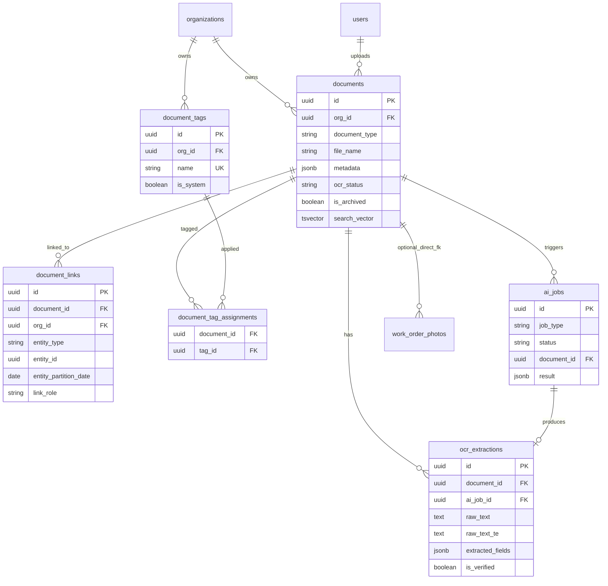
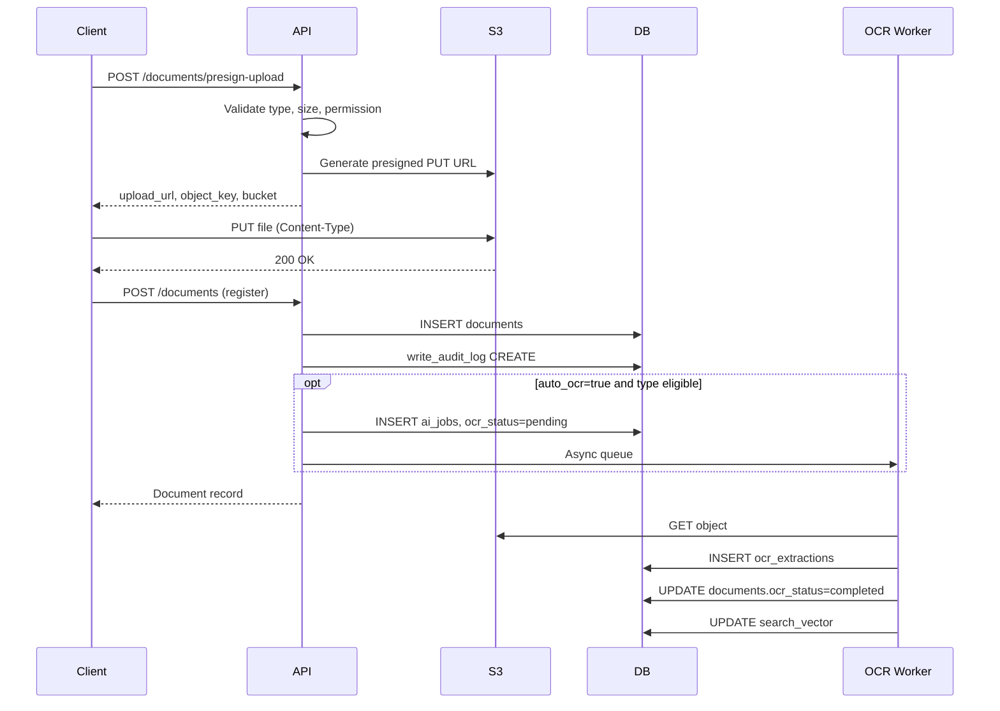
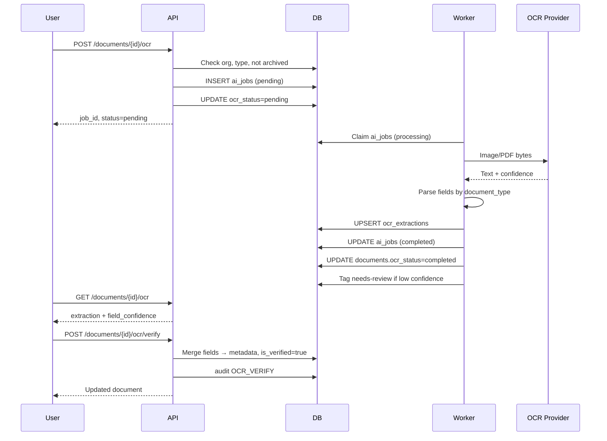

# KrishiFarms CRM — Document Management Module

**Version:** 1.0 (design)  
**Schema baseline:** Alembic through `202506210015`  
**Status:** Architecture + API contract; implementation extends existing `app/modules/documents/`

---

## 1. Executive Summary

The Document Management Module provides org-scoped storage, metadata, search, tagging, and transaction linking for operational paperwork and media across KrishiFarms CRM. It **extends** the existing documents module rather than replacing it.

**Primary document types (Phase 1):**

| Code | Label (EN) | Label (TE) | Typical use |
|------|------------|------------|-------------|
| `fuel_bill` | Fuel Bill | ఇంధన బిల్లు | Vehicle/asset fuel purchases |
| `crop_bill` | Crop Bill | పంట బిల్లు | Procurement weighment / purchase slips |
| `rental_bill` | Rental Bill | అద్దె బిల్లు | Rental agreement invoices / collections |
| `vendor_bill` | Vendor Bill | విక్రేత బిల్లు | Supplier invoices (expenses, payments) |
| `payment_receipt` | Payment Receipt | చెల్లింపు రసీదు | Farmer/vendor payment proof |
| `upi_screenshot` | UPI Screenshot | UPI స్క్రీన్‌షాట్ | UPI/IMPS transfer confirmation |
| `photo` | Photo | ఫోటో | Field photos, work-order evidence |

**Extensibility types** (already in OpenAPI; optional in UI): `weighment_slip`, `voice_note`, `whatsapp_export`, `pdf`.

Files live in **S3** (`ap-south-1`); metadata, links, tags, and OCR results live in **PostgreSQL**. Upload uses the existing **presign → PUT → register** pattern.

---

## 2. What Exists vs What To Build

### 2.1 Already implemented

| Layer | Status | Location |
|-------|--------|----------|
| `documents` table | ✅ | Migration `001`, enhanced in `007` |
| `document_links` table | ✅ Partial | Migration `001` + `007` (`org_id`, unique constraint) |
| S3 presign upload/download | ✅ | `app/shared/services/s3.py` |
| Basic REST endpoints | ✅ Partial | `POST presign-upload`, `POST /`, `GET list`, `GET by id`, `GET download-url`, `POST link` |
| OCR / AI tables | ✅ Schema only | Migration `014`: `ai_jobs`, `ocr_extractions` |
| Permissions | ✅ | `documents:read`, `documents:create`, `documents:delete` |
| OpenAPI stubs | ✅ Partial | `docs/api/paths/documents.yaml` |
| Audit logging | ✅ On create/link | `write_audit_log` in service |

### 2.2 Gaps (Phase 1 design targets)

| Gap | Proposed solution |
|-----|-------------------|
| No batch presign | `POST /documents/presign-upload/batch` |
| No search (`q`), tags, entity filters | Extend list endpoint + `search_vector` column |
| No tag tables | `document_tags`, `document_tag_assignments` |
| Partition-aware linking | `entity_partition_date` on `document_links` |
| No unlink / list links | `DELETE link`, `GET /documents/{id}/links` |
| No metadata PATCH | `PATCH /documents/{id}` |
| No soft archive in Python | Wire `DELETE` → `is_archived` (migration column exists) |
| OCR not wired | Trigger via `ai_jobs`; read from `ocr_extractions` |
| Model missing migration columns | Sync SQLAlchemy model: `locale`, `ocr_status`, `is_archived`, `archived_at` |
| `DocumentLink` missing `org_id` in model | Align model with migration `007` |
| Global search excludes documents | Add `document` to `/search` entity types (Phase 1b) |
| `rental_bill` type missing | Add to `DocumentType` enum |

---

## 3. Storage Layer (S3)

### 3.1 Bucket and region

| Setting | Default | Env var |
|---------|---------|---------|
| Bucket | `krishifarms-documents` | `S3_BUCKET_NAME` |
| Region | `ap-south-1` | `AWS_REGION` |
| Presign TTL | 900 s | `S3_PRESIGNED_URL_EXPIRE_SECONDS` |

Single bucket per environment; **org isolation is enforced by key prefix and DB `org_id`**, not separate buckets.

### 3.2 Object key structure

Current pattern (keep):

```text
org/{org_id}/{document_type}/{uuid}_{sanitized_file_name}
```

Example:

```text
org/550e8400-e29b-41d4-a716-446655440000/fuel_bill/a1b2c3d4-..._HP_Petrol_12Jun.jpg
```

**Rules:**

- `org_id` from JWT — never accept from client for key generation.
- `document_type` must match registered type at confirm time.
- UUID prefix prevents collisions and supports idempotent re-upload detection via `(org_id, s3_key)` unique index.
- Max upload size: **25 MB** (existing Pydantic constraint).

### 3.3 Presigned operations

| Operation | Method | Expiry | Notes |
|-----------|--------|--------|-------|
| Upload | `PUT` presigned URL | 900 s | `Content-Type` must match declared `mime_type` |
| Download | `GET` presigned URL | 900 s | Issued on demand; not stored in DB |

**Batch presign:** up to **20** files per request; each item gets independent `object_key` and `upload_url`.

### 3.4 Lifecycle (recommended AWS policy — Phase 1b ops)

| Tier | Rule | Action |
|------|------|--------|
| Active | Default | Standard storage |
| Archived docs (`is_archived = true`, age > 90 d) | S3 lifecycle | Transition to **S3 Intelligent-Tiering** or **Glacier Instant Retrieval** |
| Orphan objects | No DB row within 24 h of PUT | S3 event → cleanup job deletes unregistered keys |

Do **not** delete S3 objects on archive; archive is logical. Hard delete (Phase 2) requires `documents:delete` + compliance review.

### 3.5 Checksum verification

On register, client may send `checksum_sha256`. Phase 1b worker compares against S3 `HeadObject` ETag (where compatible) and flags mismatch in `metadata.verification_status`.

---

## 4. Metadata Model

### 4.1 Document row (existing + proposed)

**Existing columns** (`documents`):

| Column | Type | Notes |
|--------|------|-------|
| `id` | UUID PK | |
| `org_id` | UUID FK | Tenant scope |
| `document_type` | varchar(50) | Enum-like string |
| `file_name` | varchar(255) | Original filename |
| `mime_type` | varchar(100) | |
| `file_size_bytes` | bigint | > 0 check |
| `s3_bucket` | varchar(100) | |
| `s3_key` | varchar(500) | Unique per org |
| `checksum_sha256` | varchar(64) | Optional |
| `metadata` | JSONB | Type-specific extracted/user fields |
| `uploaded_by` | UUID FK | |
| `created_by`, `updated_by` | UUID | Audit actors |
| `created_at`, `updated_at` | timestamptz | |

**From migration 007** (not yet in SQLAlchemy model):

| Column | Type | Notes |
|--------|------|-------|
| `locale` | varchar(10) | `en`, `te`, or null (auto-detect) |
| `ocr_status` | varchar(20) | See §6 |
| `is_archived` | boolean | Soft archive (not `deleted_at`) |
| `archived_at` | timestamptz | Set on archive |

**Proposed migration `016`:**

| Column | Type | Notes |
|--------|------|-------|
| `title` | varchar(255) | Optional display title |
| `title_te` | varchar(255) | Telugu title |
| `description` | text | Free text notes |
| `description_te` | text | Telugu notes |
| `captured_at` | timestamptz | Bill date / photo taken (user or OCR) |
| `search_vector` | tsvector | Generated column for FTS |
| `ocr_requested_at` | timestamptz | Last OCR trigger time |
| `deleted_at` | timestamptz | Optional; prefer `is_archived` for docs |

### 4.2 JSONB `metadata` schema by document type

Common keys (all types):

```json
{
  "source": "mobile_app | web | whatsapp",
  "exif": { "gps_lat": 17.38, "gps_lon": 78.48, "device": "..." },
  "page_count": 1,
  "verification_status": "pending | verified | mismatch"
}
```

#### Per-type expected fields

| Type | Expected `metadata` fields | OCR targets |
|------|--------------------------|-------------|
| **fuel_bill** | `vendor_name`, `vendor_name_te`, `station_name`, `bill_date`, `fuel_type`, `quantity_liters`, `rate_per_liter`, `amount`, `vehicle_number`, `invoice_number` | Amount, date, vendor, liters, vehicle reg |
| **crop_bill** | `farmer_name`, `farmer_name_te`, `crop_name`, `crop_name_te`, `bill_date`, `bag_count`, `gross_weight_kg`, `net_weight_kg`, `rate_per_quintal`, `amount`, `procurement_number`, `moisture_pct` | Weights, bags, rate, farmer name (Telugu) |
| **rental_bill** | `customer_name`, `customer_name_te`, `agreement_number`, `bill_date`, `rental_period_start`, `rental_period_end`, `amount`, `asset_name`, `asset_name_te` | Customer, period, amount |
| **vendor_bill** | `vendor_name`, `vendor_name_te`, `invoice_number`, `bill_date`, `amount`, `tax_amount`, `category_hint`, `due_date` | Invoice no, amount, date, GSTIN |
| **payment_receipt** | `payer_name`, `payee_name`, `receipt_date`, `amount`, `payment_mode`, `reference_no`, `bank_name` | Amount, ref no, date |
| **upi_screenshot** | `upi_id`, `transaction_id`, `transaction_date`, `amount`, `sender_name`, `receiver_name`, `status` | UTR, amount, timestamp |
| **photo** | `subject`, `subject_te`, `farm_id`, `activity_type`, `gps_lat`, `gps_lon`, `captured_at` | EXIF GPS, timestamp; optional scene labels |

**EXIF extraction (photos):** On register, if `mime_type` starts with `image/`, async job reads EXIF (Pillow/exifread) and merges into `metadata.exif`. GPS stored for geo-filter (Phase 2).

### 4.3 OCR extracted fields storage

Structured OCR output lives in **`ocr_extractions.extracted_fields`** (JSONB), not duplicated into `documents.metadata` until user verifies. On verify/accept, merge selected fields into `documents.metadata` with `metadata.ocr_verified_at`.

Telugu text: `ocr_extractions.raw_text_te`, field values with `_te` suffix where applicable.

---

## 5. Tagging

### 5.1 Model (proposed)

**`document_tags`**

| Column | Type | Notes |
|--------|------|-------|
| `id` | UUID PK | |
| `org_id` | UUID FK | |
| `name` | varchar(100) | Lowercase slug, e.g. `monsoon-2026` |
| `display_name` | varchar(100) | UI label |
| `display_name_te` | varchar(100) | Telugu label |
| `is_system` | boolean | System tags not deletable by users |
| `color` | varchar(7) | Optional hex for UI |
| `created_at` | timestamptz | |

Unique: `(org_id, name)`.

**System tags (seeded per org):** `needs-review`, `ocr-verified`, `duplicate-suspect`, `whatsapp-import`.

**`document_tag_assignments`**

| Column | Type | Notes |
|--------|------|-------|
| `document_id` | UUID FK → documents | CASCADE |
| `tag_id` | UUID FK → document_tags | CASCADE |
| `assigned_by` | UUID FK → users | |
| `assigned_at` | timestamptz | |

PK: `(document_id, tag_id)`.

### 5.2 Behavior

- Free tags: created on first use via `POST /documents/tags` or inline on document PATCH.
- List/filter: `tag` query param (repeatable or comma-separated).
- System tags auto-applied: `needs-review` when OCR completes with low confidence; removed on verify.

---

## 6. OCR Readiness

### 6.1 Existing tables (migration 014)

```
ai_jobs ──► ocr_extractions
   ▲              │
   │              └── document_id (FK)
   └── job_type = 'ocr', input_type = 'document'
```

**`ai_jobs`:** async queue row — `status`: `pending | processing | completed | failed | cancelled`.

**`ocr_extractions`:** result store — `raw_text`, `raw_text_te`, `extracted_fields`, `field_confidence`, `is_verified`.

**`documents.ocr_status`:** denormalized cache for list filters:

| Value | Meaning |
|-------|---------|
| `null` | OCR never requested / not applicable (e.g. voice) |
| `pending` | Job queued or running |
| `completed` | Extraction available |
| `failed` | Job failed |
| `skipped` | Type not OCR-eligible (optional) |

### 6.2 OCR-eligible types

`fuel_bill`, `crop_bill`, `rental_bill`, `vendor_bill`, `payment_receipt`, `upi_screenshot` — **not** raw `photo` unless `metadata.subject` indicates receipt (Phase 2 auto-classify).

### 6.3 Pipeline flow

1. **Trigger:** `POST /documents/{id}/ocr` (or auto on register when `auto_ocr: true`).
2. **Enqueue:** Insert `ai_jobs` row; set `documents.ocr_status = 'pending'`, `ocr_requested_at = now()`.
3. **Worker:** Fetch S3 object → OCR provider (Google Vision / AWS Textract / Tesseract+TE model) → Telugu + English text.
4. **Parse:** Type-specific field extractor (rules + LLM fallback via `ai_jobs.result`).
5. **Persist:** Insert/update `ocr_extractions`; optional `ai_suggestions` for auto-create expense/procurement (existing AI module).
6. **Complete:** `documents.ocr_status = 'completed'`; index `search_vector` with OCR text.
7. **Review:** User verifies via `POST /documents/{id}/ocr/verify`; sets `is_verified`, merges fields to metadata.

### 6.4 Telugu support

- OCR engine configured for **Telugu + English** (`te`, `en`).
- Store parallel columns: `raw_text`, `raw_text_te` (either may be null if mono-language doc).
- Search uses PostgreSQL `simple` + custom Telugu dictionary (Phase 1b) or `pg_trgm` fallback.

---

## 7. Search

### 7.1 Document list search (`GET /documents`)

| Parameter | Type | Description |
|-----------|------|-------------|
| `q` | string | Full-text across title, file_name, description, OCR text |
| `document_type` | enum | Filter by type |
| `tag` | string[] | Tag names (AND semantics) |
| `entity_type` | string | Linked entity type |
| `entity_id` | uuid | Linked entity ID |
| `entity_partition_date` | date | Required with entity_id for partitioned entities |
| `ocr_status` | enum | |
| `is_archived` | boolean | Default `false` |
| `date_from`, `date_to` | date | Filter on `captured_at` or `created_at` |
| `uploaded_by` | uuid | |
| `sort` | string | `-created_at`, `captured_at`, `file_name` |
| `page`, `page_size` | int | Pagination |

### 7.2 Index strategy (proposed migration 016)

```sql
-- Generated column (conceptual)
search_vector tsvector GENERATED ALWAYS AS (
  setweight(to_tsvector('simple', coalesce(title, '')), 'A') ||
  setweight(to_tsvector('simple', coalesce(file_name, '')), 'B') ||
  setweight(to_tsvector('simple', coalesce(description, '')), 'C') ||
  setweight(to_tsvector('simple', coalesce(metadata->>'vendor_name', '')), 'C')
) STORED;

CREATE INDEX ix_documents_search_vector ON documents USING GIN (search_vector);
CREATE INDEX ix_documents_file_name_trgm ON documents USING GIN (file_name gin_trgm_ops);
```

OCR text: trigger on `ocr_extractions` insert updates parent `search_vector` via function.

**Existing:** GIN on `metadata` jsonb_path_ops (`ix_documents_metadata`) — keep for structured field queries.

### 7.3 Global search integration (Phase 1b)

Extend `GET /search?entity_types=document` to query `documents.search_vector` with same org scope.

---

## 8. Transaction Linking (Polymorphic)

### 8.1 Existing `document_links`

| Column | Status |
|--------|--------|
| `document_id` | ✅ |
| `entity_type` | ✅ varchar(50) |
| `entity_id` | ✅ UUID |
| `link_role` | ✅ default `primary_attachment` |
| `org_id` | ✅ migration 007 |
| `created_by` | ✅ migration 007 |

### 8.2 Proposed additions (migration 016)

| Column | Type | Notes |
|--------|------|-------|
| `entity_partition_date` | date, nullable | **Required** for partitioned entities |
| `deleted_at` | timestamptz, nullable | Soft unlink |
| `notes` | text | Optional link annotation |

Update unique index to include `entity_partition_date`:

```sql
UNIQUE (document_id, entity_type, entity_id, entity_partition_date, link_role)
WHERE deleted_at IS NULL
```

### 8.3 Supported `entity_type` values

| entity_type | Partition key param | Typical doc types | link_role examples |
|-------------|---------------------|-------------------|-------------------|
| `procurement` | `procurement_date` | crop_bill, photo | `weighment_slip`, `primary_attachment` |
| `farmer_payment` | `payment_date` | payment_receipt, upi_screenshot | `payment_proof` |
| `expense` | — | vendor_bill, fuel_bill | `invoice`, `primary_attachment` |
| `payment` | `payment_date` | vendor_bill, upi_screenshot | `payment_proof` |
| `collection` | — | upi_screenshot, rental_bill | `collection_proof` |
| `rental_agreement` | — | rental_bill | `invoice` |
| `vehicle_trip` | `trip_date` | fuel_bill | `fuel_receipt` |
| `work_order` | — | photo | `completion_photo`, `primary_attachment` |
| `asset` | — | fuel_bill, photo | `maintenance_receipt` |
| `farmer` | — | any | `kyc`, `general` |

**Validation:** On link, service resolves entity exists in org. For partitioned types, **reject** if `entity_partition_date` missing or row not found.

**Dual linking patterns:**

1. **Explicit:** `POST /documents/{id}/link` (canonical, audit trail).
2. **Embedded:** `document_ids[]` on expense/collection create (existing API) — service creates `document_links` rows internally.

---

## 9. Security & RBAC

### 9.1 Permissions (existing)

| Permission | Capability |
|------------|------------|
| `documents:read` | List, get, download, view OCR, list tags/links |
| `documents:create` | Presign, register, link, tag, trigger OCR |
| `documents:delete` | Archive documents |
| `ai:read` | View OCR extraction detail (optional split) |
| `ai:review` | Verify OCR / accept AI suggestions |

### 9.2 Role matrix (default seed)

| Role | read | create | delete | OCR verify |
|------|------|--------|--------|------------|
| OWNER | ✅ | ✅ | ✅ | ✅ |
| MANAGER | ✅ | ✅ | ✅ | ✅ |
| ACCOUNTANT | ✅ | ✅ | ❌ | ✅ |
| SUPERVISOR | ✅ | ✅ | ❌ | ❌ |
| WORKER | ✅ | ✅ (photo only*) | ❌ | ❌ |

\*Phase 1b: restrict WORKER uploads to `document_type=photo` via policy check.

### 9.3 Access rules

- All queries filter `org_id = JWT org_id`.
- Download URLs are presigned, short-lived; no public ACL on bucket.
- Archived documents: readable with `is_archived=true` filter; not returned in default list.
- Cross-org link attempts → `404` (not `403`) to avoid entity enumeration.

---

## 10. Audit Trail

Uses existing `audit_logs` + optional `activity_feed`.

| Action | entity_type | When |
|--------|-------------|------|
| `CREATE` | `document` | Register |
| `UPDATE` | `document` | Metadata/tags patch |
| `ARCHIVE` | `document` | Soft delete |
| `LINK` | `document` | Link to transaction |
| `UNLINK` | `document` | Remove link |
| `OCR_TRIGGER` | `document` | OCR requested |
| `OCR_VERIFY` | `document` | User verified extraction |

`before_state` / `after_state` JSON includes changed fields only.

---

## 11. Entity Relationship Diagram



---

## 12. Sequence Diagrams

### 12.1 Upload flow



### 12.2 OCR flow



---

## 13. Integration Strategy (Extend vs Replace)

**Extend** the current module:

| Component | Action |
|-----------|--------|
| `app/modules/documents/models.py` | Add missing columns; add Tag models |
| `app/modules/documents/service.py` | Add search, tags, archive, OCR trigger, partition validation |
| `app/modules/documents/router.py` | Add new routes; enhance list filters |
| `app/modules/documents/schemas.py` | Extend request/response models |
| `app/shared/services/s3.py` | Optional: batch presign helper |
| New worker | `app/workers/ocr_worker.py` (Phase 1b implementation) |

Do **not** create a parallel upload path. Expense/collection/work-order `document_ids[]` should delegate to shared `link_document` service.

---

## 14. Proposed Database Migration Summary (`016_document_management`)

### New tables

- `document_tags`
- `document_tag_assignments`

### Alter `documents`

- `title`, `title_te`, `description`, `description_te`
- `captured_at`, `search_vector`, `ocr_requested_at`

### Alter `document_links`

- `entity_partition_date`, `deleted_at`, `notes`
- Replace unique index with partial index (see §8.2)

### Indexes

- GIN `search_vector`
- GIN trigram on `file_name`
- `ix_document_links_entity` on `(org_id, entity_type, entity_id, entity_partition_date)`

### Seed data

- System tags per org (on org create hook or migration backfill)

---

## 15. Phase 2 / Gaps

| Item | Priority | Notes |
|------|----------|-------|
| OCR worker implementation | P1 | Schema ready; needs provider config |
| Auto-classify document type from image | P2 | ML classifier |
| Duplicate detection (checksum/perceptual hash) | P2 | `duplicate-suspect` tag |
| WhatsApp inbound → document pipeline | P2 | `whatsapp_messages.media_document_id` exists |
| Versioning (replace bill with corrected upload) | P2 | `document_versions` table |
| Fine-grained WORKER upload restrictions | P2 | Policy engine |
| Glacier lifecycle automation | P3 | Ops runbook |
| Full-text Telugu dictionary | P2 | Search quality |
| Bulk export / ZIP download | P3 | |
| `documents:delete` hard delete + S3 purge | P3 | Compliance |

---

## 16. References

- Implementation: `app/modules/documents/`
- Migrations: `202506210007`, `202506210014`
- API: `docs/api/paths/documents.yaml`, `docs/api/schemas/documents.yaml`
- S3: `app/shared/services/s3.py`, `app/core/config.py`
- Partitioned entities: `docs/api/API_CONTRACT.md` §6
