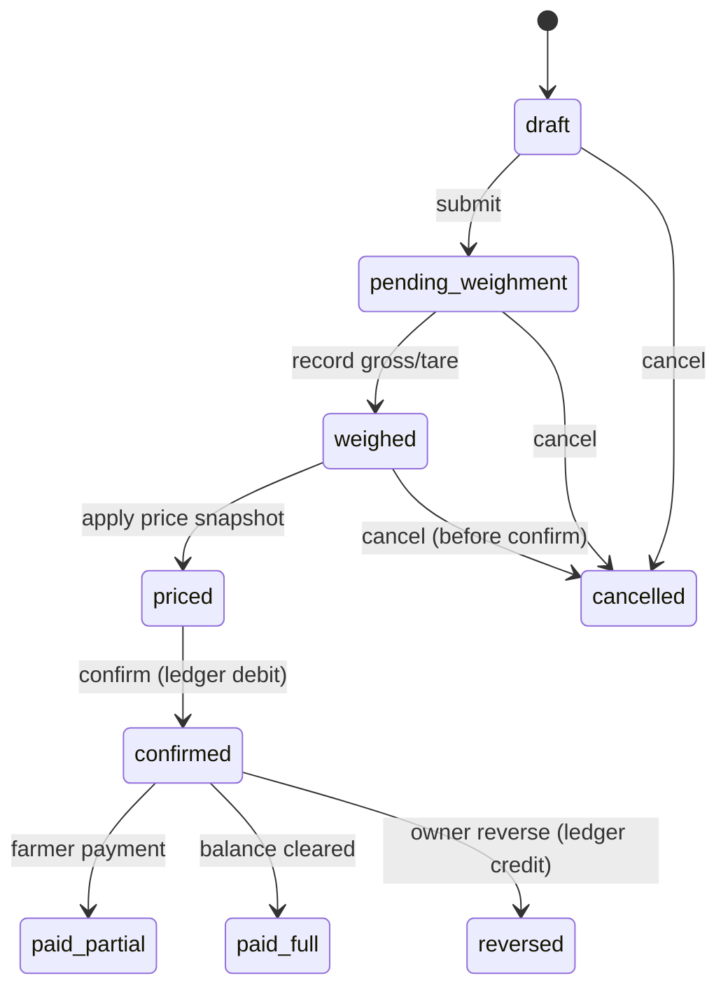

# Procurement Module — Spec (Phase 2b)

Procurement tickets capture paddy/corn intake from farmers. **Implemented** in `app/modules/procurements/` — schema in migration `202506210008` (+ status workflow `019`), OpenAPI in `docs/api/paths/procurement.yaml`.

## Ticket state machine



| State | Meaning | Ledger impact |
|-------|---------|---------------|
| `draft` | Field capture in progress | None |
| `pending_weighment` | Awaiting scale reading | None |
| `weighed` | Gross/tare/net recorded | None |
| `priced` | Rate applied from snapshot | None |
| `confirmed` | Approved intake | **Debit** farmer ledger |
| `paid_partial` / `paid_full` | Payment linked | Credit via payment module |
| `cancelled` | Void before confirm | None |
| `reversed` | Post-confirm correction | **Credit** reversing entry |

## Weighment & net weight

At weighment (`record_weighment`), the payable **net weight** is computed as:

```
net_weight_kg = gross_weight_kg − tare_weight_kg − (bag_count × per_bag_deduction_kg)
```

- `per_bag_deduction_kg` — standard per-bag weight deduction (kata), column on `procurements`, **default `2.000` kg** (migration `035`). Configurable at draft create and overridable at weighment; `>= 0` (check constraint).
- `bag_weight_deduction_kg` — computed response field = `bag_count × per_bag_deduction_kg`.
- Worked example: 50 bags × 50 kg = 2500 kg gross; 2 kg/bag → 100 kg deducted → **2400 kg** net payable.
- Helpers: `compute_bag_weight_deduction`, `compute_net_weight` (`service.py`).

## Pricing snapshot

At confirm time, freeze:

- `crop_type_id`, `rate_per_quintal` from active `crop_price_rules` (village-specific override → org default)
- `deduction_rules` applied (moisture, impurity, monetary lines) — note the **per-bag weight** deduction is applied earlier at weighment (see above), not as a money line
- `net_quintals`, `gross_amount`, `deduction_amount`, `net_amount`

Snapshot columns live on `procurements` — never recalculate from live price rules after confirm.

## Deductions

| Type | Typical input | Effect |
|------|---------------|--------|
| Moisture | % over threshold | Reduce net quintals |
| Impurity | % | Reduce net quintals |
| Per-bag weight (kata) | bag_count × `per_bag_deduction_kg` (default 2 kg) | Reduce **net weight** at weighment |
| Manual adjustment | amount INR | Line item on ticket |

Deduction lines: `procurement_deductions` (child table). The per-bag weight deduction is not a `procurement_deductions` row — it reduces `net_weight_kg` directly at weighment.

## Key relations

- `farmer_id` → `farmers`
- `village_id`, `crop_type_id`
- `buyer_id` → `buyers` (optional; migration `026`)
- `payment_terms` / `payment_terms_custom` / `expected_payment_date` (migration `026`)
- Planned moisture % and rate at create may still live in `notes` as `[kf:proc]…[/kf:proc]` until first-class planned columns exist
- `created_by` field agent / supervisor
- Comments: `entity_type=procurement`
- Photos: documents link `entity_type=procurement`

### Web create form (`/procurement/new`)

- Searchable Autocomplete: farmer, crop; District → Mandal → Village cascade; buyer + **inline Add buyer**
- First-class `buyer_id` + payment terms (One Week / 10 Days / 2 Weeks / 20 Days / Custom)
- Optional planned moisture % (defaults from crop) and rate/quintal → `[kf:proc]` notes
- Bag count + **per-bag deduction (kg)** (default 2) + free-text notes

### Web detail workflow (`/procurement/[id]`) — Ralph Loop 2

- Status-driven actions (`workflow-actions.tsx`): **Submit** → **Weighment** (gross/tare/moisture/bags/**per-bag deduction** with live net-weight preview) → **Apply price** → **Confirm** / **Cancel** / **Reverse**
- Permission guards: `procurements:update` | `confirm` | `cancel` (OWNER also for reverse)
- Shows buyer, payment terms (API fields with notes fallback), moisture, status chip
- Photo upload via documents presign → S3 → register → link (`EntityDocumentUpload`); historical gallery awaits entity-filtered list
- Comments thread

Client: `frontend/src/features/procurements/{api,workflow-actions,draft-extras}.ts(x)`

## Phase 2b implementation checklist

- [x] `app/modules/procurements/` router, service, models
- [x] State transition guards + permission map (`procurements:confirm`, etc.)
- [x] Price snapshot service reading `crop_price_rules`
- [x] Ledger write on confirm (immutable entries)
- [x] Wire `attach_entity_notes` on detail
- [x] Tests for state machine + RBAC
- [x] Update AGENT_GUIDE matrix
- [x] Web workflow UI (submit → weigh → price → confirm)
- [x] `buyer_id` + payment terms columns (`026`) + web create/detail

## Related

- Farmers: [FARMERS.md](./FARMERS.md)
- Reporting SQL: `docs/reporting/sql/01_procurement.sql`
- Cross-cutting: [CROSS_CUTTING.md](./CROSS_CUTTING.md)
