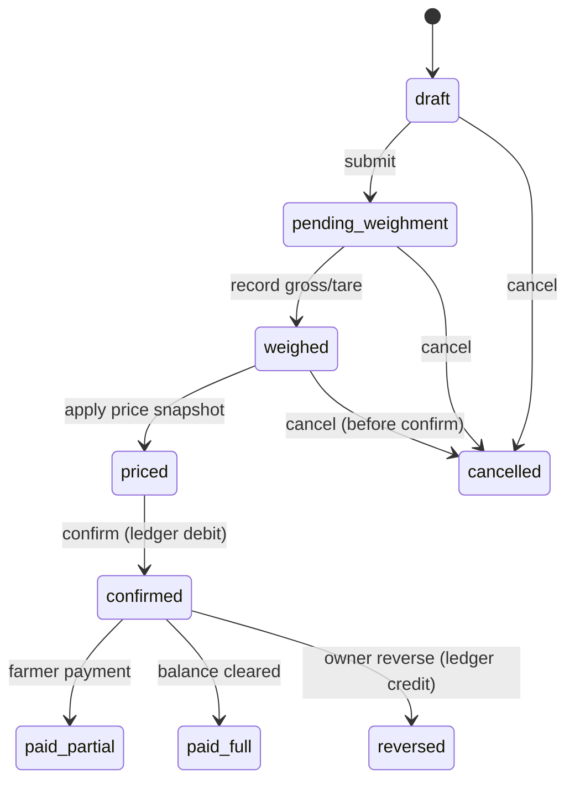

# Procurement Module — Spec (Phase 2b)

Procurement tickets capture paddy/corn intake from farmers. **Implemented** in `app/modules/procurements/` — schema in migration `202506210008` (+ status workflow `019`), OpenAPI in `docs/api/paths/procurement.yaml`.

## Ticket state machine

| State | Meaning | Ledger impact |
|-------|---------|---------------|
| `draft` | Field capture in progress | None |
| `pending_weighment` | Awaiting scale reading | None |
| `weighed` | Gross/tare/net recorded | None |
| `priced` | Rate applied from snapshot | None |
| `confirmed` | Approved intake | **Debit** farmer ledger |
| `paid_partial` / `paid_full` | Payment linked | Credit via payment module |
| `cancelled` | Void before confirm | None |
| `reversed` | Post-confirm correction | **Credit** reversing entry |

## Pricing snapshot

At confirm time, freeze:

- `crop_type_id`, `rate_per_quintal` from active `crop_price_rules` (village-specific override → org default)
- `deduction_rules` applied (moisture, impurity, bag weight)
- `net_quintals`, `gross_amount`, `deduction_amount`, `net_amount`

Snapshot columns live on `procurements` — never recalculate from live price rules after confirm.

## Deductions

| Type | Typical input | Effect |
|------|---------------|--------|
| Moisture | % over threshold | Reduce net quintals |
| Impurity | % | Reduce net quintals |
| Bag tare | count × bag weight | Reduce gross weight |
| Manual adjustment | amount INR | Line item on ticket |

Deduction lines: `procurement_deductions` (child table).

## Key relations

- `farmer_id` → `farmers`
- `village_id`, `crop_type_id`, `buyer_id` (optional)
- `created_by` field agent / supervisor
- Comments: `entity_type=procurement`

## Phase 2b implementation checklist

- [x] `app/modules/procurements/` router, service, models
- [x] State transition guards + permission map (`procurements:confirm`, etc.)
- [x] Price snapshot service reading `crop_price_rules`
- [x] Ledger write on confirm (immutable entries)
- [x] Wire `attach_entity_notes` on detail
- [x] Tests for state machine + RBAC
- [x] Update AGENT_GUIDE matrix

## Related

- Farmers: [FARMERS.md](./FARMERS.md)
- Reporting SQL: `docs/reporting/sql/01_procurement.sql`
- Cross-cutting: [CROSS_CUTTING.md](./CROSS_CUTTING.md)
