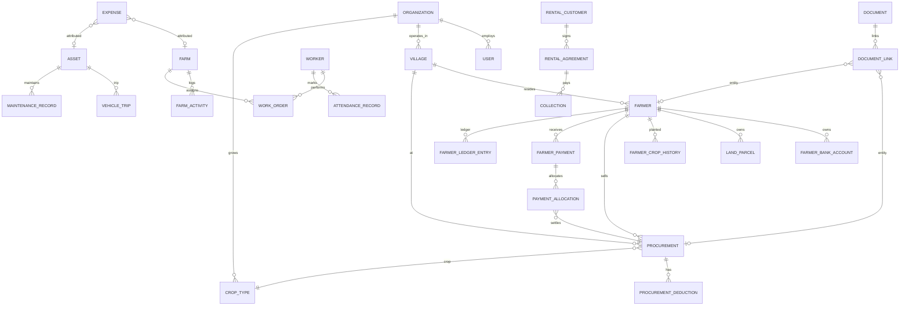

# Information Architecture — KrishiFarms CRM

**Version:** 1.0  
**Platform:** Next.js (responsive web)  
**Locale:** English (default) · Telugu (`te`)

---

## 1. Complete Navigation Tree

Primary sidebar navigation. Items marked `(P1)` have live API; `(P2+)` are designed ahead of Python implementation.

```text
KrishiFarms CRM
├── Home
│   ├── Executive Dashboard (CEO)          (P1 stub → P2+ KPIs)
│   ├── Procurement Dashboard              (P2)  → PROC-* KPIs
│   ├── Payments Dashboard                 (P2)  → PAY-* KPIs
│   ├── Profitability                      (P3+) → PNL-* KPIs
│   └── Farm Operations                    (P4)  → FARM-* KPIs
│
├── Operations
│   ├── Collection Entry                   (P2)  ← Field Officer home
│   ├── Procurements
│   │   ├── Board (Kanban)                 (P2)
│   │   ├── Table View                     (P2)
│   │   └── Dispatch Map                   (P2+) operational overlay
│   ├── Farmers
│   │   ├── All Farmers                    (P2)
│   │   └── Onboarding Queue               (P2)
│   └── Documents                          (P1 partial)
│       ├── Library
│       ├── Upload Queue
│       └── OCR Review                       (P5)
│
├── Finance
│   ├── Farmer Payments                    (P2)
│   ├── Outstanding & Ledger               (P2)
│   ├── Collections                        (P3)
│   ├── Expenses                           (P3)
│   ├── Vendor Payments                    (P3)
│   └── Rental Collections (AR)            (P5)
│
├── Fleet & Assets
│   ├── Vehicle Trips                      (P5)
│   ├── Fleet Overview                     (P5)  → VEH-* KPIs
│   ├── Assets Registry                    (P5)
│   └── Maintenance                        (P5)
│
├── Workforce
│   ├── Workers                            (P4)
│   ├── Work Orders                        (P4)
│   ├── Attendance                         (P4)
│   └── Productivity                       (P4)  → WRK-* KPIs
│
├── Rentals
│   ├── Agreements                         (P5)
│   ├── Customers                          (P5)
│   └── Rental Dashboard                   (P5)  → RENT-* KPIs
│
├── Farms
│   ├── Farm List                          (P4)
│   ├── Activities                         (P4)
│   └── Leases                             (P4)
│
├── Reports
│   ├── Saved Reports                      (P2+)
│   └── Export Center                      (P2+)
│
└── Settings
    ├── Organization                       (P1)
    ├── Users & Roles                      (P1)
    ├── Villages                           (P1)
    ├── Crop Types                         (P1)
    ├── Expense Categories                 (P1)
    ├── Payment Modes                      (P3 master)
    ├── Activity Types                     (P4 master)
    ├── Audit Log                          (P1)
    └── Activity Feed                      (P1)
```

### 1.1 Default home by persona

| Persona | Default route | Rationale |
|---------|---------------|-----------|
| Super Admin | `/dashboard/executive` | Org-wide P&L and health |
| Procurement Manager | `/procurements/board` | Draft backlog + today's intake |
| Accountant | `/finance/payments` | Outstanding + settlement queue |
| Field Officer | `/operations/collection-entry` | Start collection timeline |
| Farm Manager | `/dashboard/farm-operations` | Farms, labor, fleet |

---

## 2. Role-Based Navigation Matrix

UX personas map to backend roles in migration `202506210015`. Cells: **●** full access · **◐** read/create limited · **○** hidden · **—** not applicable.

| Nav item | Super Admin | Procurement Mgr | Accountant | Field Officer | Farm Manager |
|----------|:-----------:|:---------------:|:----------:|:-------------:|:------------:|
| Executive Dashboard | ● | ◐ | ◐ | ○ | ◐ |
| Procurement Dashboard | ● | ● | ◐ | ◐ | ○ |
| Payments Dashboard | ● | ◐ | ● | ○ | ○ |
| Profitability | ● | ○ | ● | ○ | ○ |
| Farm Operations | ● | ○ | ○ | ◐ | ● |
| Collection Entry | ● | ● | ○ | ● | ◐ |
| Procurements (Board/Table/Map) | ● | ● | ◐ | ◐ | ○ |
| Farmers | ● | ● | ● | ● | ◐ |
| Documents | ● | ● | ● | ● | ● |
| Farmer Payments | ● | ◐ | ● | ○ | ○ |
| Outstanding & Ledger | ● | ◐ | ● | ○ | ○ |
| Collections / Expenses / Vendor Pay | ● | ○ | ● | ○ | ◐ |
| Vehicle Trips / Fleet | ● | ◐ | ◐ | ● | ● |
| Workforce | ● | ○ | ○ | ◐ | ● |
| Rentals | ● | ◐ | ● | ○ | ● |
| Farms | ● | ○ | ○ | ◐ | ● |
| Reports | ● | ● | ● | ◐ | ● |
| Settings → Users/Roles | ● | ○ | ○ | ○ | ○ |
| Settings → Master data | ● | ◐ | ◐ | ○ | ◐ |
| Audit Log | ● | ◐ | ◐ | ○ | ◐ |

**Backend role mapping**

| UX Persona | Primary `role.code` | Notes |
|------------|---------------------|-------|
| Super Admin | `OWNER` | All permissions |
| Procurement Manager | `MANAGER` | UI filters nav to procurement + farmers |
| Accountant | `MANAGER` | UI filters nav to finance modules |
| Field Officer | `SUPERVISOR` | Collection + farmers + docs + trips |
| Farm Manager | `SUPERVISOR` | Emphasis farms, workforce, fleet |

Phase 1 Python seeds only OWNER/MANAGER/SUPERVISOR/WORKER subset in `app/shared/permissions.py`; full matrix applies when Phase 2+ routes ship.

---

## 3. Entity Relationship Model (CRM Domain)

Conceptual ER for UI linking, breadcrumbs, and global search grouping.



### 3.1 UI linking rules

| From screen | Common jumps |
|-------------|--------------|
| Farmer profile | Procurement row → procurement detail; ledger row → payment; document → viewer |
| Procurement card | Farmer avatar → profile; village chip → filtered list; trip → dispatch map |
| Payment detail | Allocation lines → procurement; farmer header → profile |
| Vehicle trip | Asset → fleet card; linked procurement dispatch |
| Document | Linked entities in sidebar; OCR verify → procurement pre-fill |

**Partition awareness:** Procurement, farmer payment, and vehicle trip detail URLs include date query: `/procurements/{id}?date=2026-06-15`.

---

## 4. Global vs Contextual Navigation

### 4.1 Global (persistent)

| Element | Location | Behavior |
|---------|----------|----------|
| **Sidebar** | Left, collapsible | Module groups; badge counts (draft procurements, pending OCR) |
| **Top bar** | Sticky | Org name, global search, ⌘K, notifications, profile |
| **Command palette** | Overlay | Actions + navigation + entity jump |
| **Breadcrumbs** | Below top bar on L2+ | `Finance › Farmer Payments › FP-2026-0088` |
| **Quick create (+)** | Top bar | Role-filtered: New farmer, Collection entry, Expense, Upload |

### 4.2 Contextual (within entity / workflow)

| Context | Navigation pattern |
|---------|-------------------|
| **Farmer Profile 360** | Tab bar: Overview · Procurements · Ledger · Land & Crops · Documents · Activity · Banking |
| **Collection workflow** | Horizontal timeline stepper (not sidebar); back exits to queue |
| **Procurement board** | Column headers = status; card click → slide-over detail |
| **Payment settlement** | Split view: payment list left, allocation panel right |
| **Document viewer** | Right drawer: metadata, links, OCR; main = preview |
| **Dashboard** | Date range + village/crop filters persist in URL query |

### 4.3 URL structure (deep linking)

```text
/dashboard/{dashboardId}?from=&to=&village=&crop=
/operations/collection-entry/{sessionId}?step=quality
/procurements/board?status=draft&village=
/procurements/{id}?date=
/farmers/{id}/{tab}
/finance/payments/{id}?date=
/fleet/trips/{id}?date=
/documents/{id}
/settings/{section}
```

---

## 5. Search & Discovery Layers

| Layer | Scope | API | Phase |
|-------|-------|-----|-------|
| **List search** | Current module `q=` param | Per-module GET | P2+ |
| **Global search** | Cross-entity ranked | `GET /search?q=&entity_types=` | P5+ |
| **Command palette** | Nav + actions + recent | Local + global search | P1 nav only initially |
| **Smart filters** | Saved views on lists | Client-side + query sync | P2+ |

Global search result groups (order): Farmers → Procurements → Payments → Documents → Trips → Work orders.

---

## 6. Content Hierarchy Depth

| Level | Example | Max clicks from home |
|-------|---------|----------------------|
| L0 | Dashboard | 0 |
| L1 | Farmer list | 1 |
| L2 | Farmer profile tab | 2 |
| L3 | Procurement detail slide-over | 2 (overlay) |
| Workflow | Collection entry steps | 1 (same route, step param) |

Target: **any entity reachable in ≤2 clicks** via ⌘K or global search.

---

## 7. Empty & Onboarding States (IA)

| Area | First-run empty |
|------|-----------------|
| Farmers | CTA: Import / Add first farmer (Bhairkhanpally template) |
| Procurements | Show sample Kanban columns with "Start collection entry" |
| Documents | Drag-drop upload zone + presign flow explanation |
| Dashboard P1 | "Connect Phase 2 modules" banner with implementation status |

---

## Cross-References

- Screen detail: [SCREEN_SPECS.md](./SCREEN_SPECS.md)
- Flows: [NAVIGATION_AND_FLOWS.md](./NAVIGATION_AND_FLOWS.md)
- Components: [COMPONENT_LIBRARY.md](./COMPONENT_LIBRARY.md)
