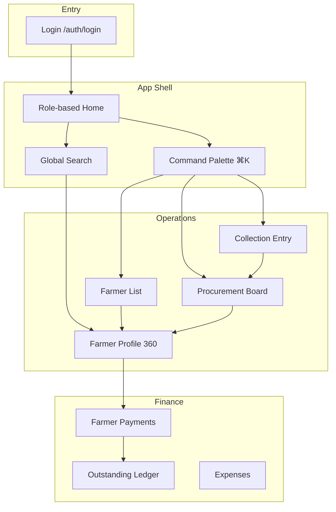
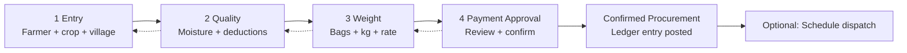
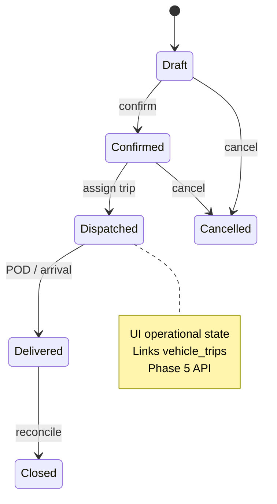
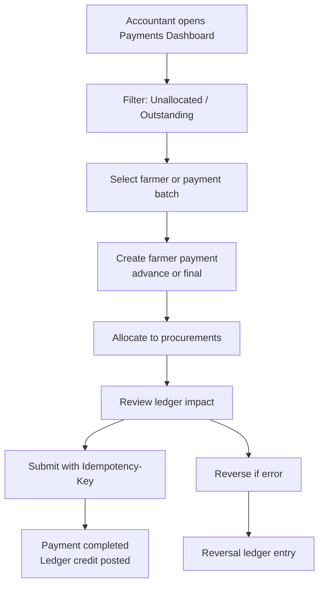
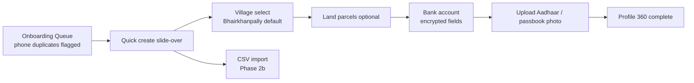
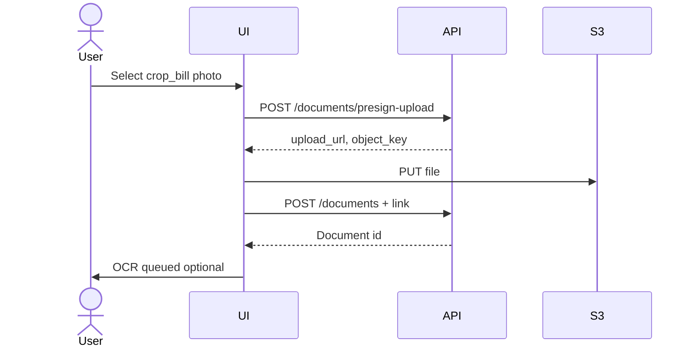
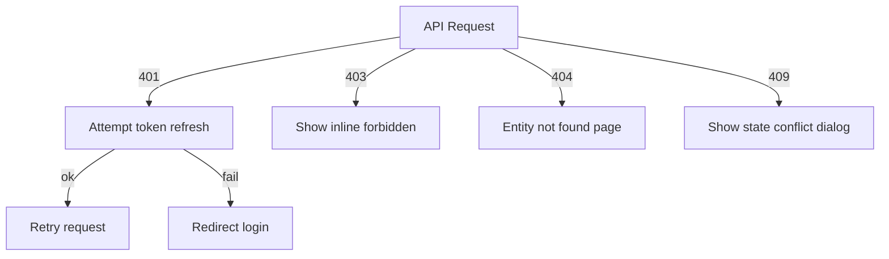

# Navigation & User Flows — KrishiFarms CRM

---

## 1. Primary Navigation Flow



---

## 2. Collection Entry Workflow

Timeline-based flow — **not** a step wizard with locked Next buttons.



### Step details

| Step | User | Validation | API (P2) |
|------|------|------------|----------|
| Entry | Field Officer | Farmer required, crop ∈ {Paddy, Corn} | `POST /procurements` draft |
| Quality | Field Officer | Moisture 0–100%; deductions ≥ 0 | `PATCH` + `POST .../deductions` |
| Weight | Field Officer | gross ≥ net; rate > 0 | `PATCH` |
| Approval | Supervisor/Manager | Document optional; confirm permission | `POST .../confirm` |

### Exit paths

- **Save draft:** Any step → returns to board Draft column.
- **Cancel:** Reason dialog → `POST .../cancel`.
- **Attach weighment slip:** Opens document upload drawer; link via `POST /documents/{id}/link`.

---

## 3. Procurement Dispatch Flow



### Dispatch interaction

1. Confirmed card → "Dispatch" → select vehicle trip or create trip.
2. Map view shows active dispatches (Bhairkhanpally → mill route placeholder).
3. Delivered: capture photo document + timestamp.

---

## 4. Payment Settlement Flow



### API sequence (P2)

1. `GET /farmers/{id}/outstanding`
2. `POST /farmer-payments`
3. `POST /farmer-payments/{id}/allocate`
4. Optional: link `upi_screenshot` document

---

## 5. Farmer Onboarding Flow



### Duplicate detection

- Match on `phone_primary` → show merge dialog.
- Farmer code auto-generated server-side (`farmer_code`).

---

## 6. Document Upload Flow (linked)



Phase 1: presign + register live. OCR: P5.

---

## 7. Keyboard Shortcuts

Global shortcuts disabled when typing in input (except `Escape`).

### Global

| Shortcut | Action |
|----------|--------|
| `⌘ K` / `Ctrl K` | Open command palette |
| `/` | Focus search |
| `Esc` | Close overlay / clear selection |
| `?` | Show shortcuts help modal |
| `⌘ \` | Toggle sidebar |

### Navigation (G then key — Linear-style)

| Chord | Destination |
|-------|-------------|
| `G` `D` | Dashboard (role default) |
| `G` `F` | Farmers list |
| `G` `P` | Procurement board |
| `G` `C` | Collection entry |
| `G` `Y` | Farmer payments |
| `G` `O` | Documents |
| `G` `S` | Settings |

### Contextual

| Context | Shortcut | Action |
|---------|----------|--------|
| Farmer list | `N` | New farmer |
| Farmer list | `E` | Export CSV |
| Table | `⌘ A` | Select all page |
| Table | `J` / `K` | Next / prev row |
| Table | `Enter` | Open row detail |
| Collection workflow | `⌘ S` | Save draft |
| Collection workflow | `⌘ Enter` | Confirm step (approval only) |
| Command palette | `↑` `↓` | Navigate |
| Command palette | `Enter` | Execute |

### Accessibility

All shortcuts have menu equivalents; show in tooltip with platform-correct modifier (⌘ vs Ctrl).

---

## 8. Quick Actions (+ Menu)

Role-filtered top-bar menu:

| Action | Roles | Route / behavior |
|--------|-------|------------------|
| New collection entry | Field Officer, Proc Mgr | `/operations/collection-entry` |
| New farmer | Proc Mgr, Field Officer | Slide-over create |
| Record payment | Accountant | Payment slide-over |
| Upload document | All with permission | Upload modal |
| New expense | Accountant, Farm Mgr | `/finance/expenses/new` |
| Log vehicle trip | Field Officer, Farm Mgr | Trip slide-over |
| New work order | Farm Mgr | Work order form |

---

## 9. Global Search Behavior

### Phase 1 (local)

- Command palette searches static nav + recent entities (local cache only).
- List pages use module `q=` search.

### Phase 5 (`GET /search`)

| Query type | Example | Result |
|------------|---------|--------|
| Farmer name | `rajesh` | Farmers ranked by relevance |
| Phone | `98765` | Farmer match |
| Code | `PR-2026` | Procurement |
| Telugu | `రాజేష్` | Bilingual match on `*_te` fields |

**Parameters:** `q`, `entity_types=farmer,procurement,farmer_payment,document`

**Result row:** Icon + primary label + secondary meta + keyboard hint `↵`

**On select:** Navigate to detail with partition date if required.

### Search overlay layout

```text
┌─────────────────────────────────────────┐
│ 🔍  rajesh                               │
├─────────────────────────────────────────┤
│ FARMERS (2)                              │
│   Rajesh Kumar · FRM-0042 · Bhairkhan…  │
│ PROCUREMENTS (1)                         │
│   PR-2026-0142 · ₹1,12,500 · Confirmed  │
└─────────────────────────────────────────┘
```

Debounce 300 ms · min 2 characters · show recent when empty.

---

## 10. Notification & Activity Feed Flow

P1: `GET /activity-feed` — bell icon dropdown.

| Event type | Notification | Deep link |
|------------|--------------|-----------|
| procurement.confirmed | "45 qtl paddy confirmed" | Procurement detail |
| document.ocr.completed | "Weighment slip OCR ready" | OCR review |
| farmer_payment.completed | "Payment ₹50,000 completed" | Payment detail |

Mark read on click; "View all" → Settings › Activity or dedicated feed page.

---

## 11. Error & Session Flows



Preserve scroll and form draft in sessionStorage on 401 redirect where safe (non-financial).

---

## Cross-References

- IA: [INFORMATION_ARCHITECTURE.md](./INFORMATION_ARCHITECTURE.md)
- Wireframes: [WIREFRAMES.md](./WIREFRAMES.md)
- Screen specs: [SCREEN_SPECS.md](./SCREEN_SPECS.md)
